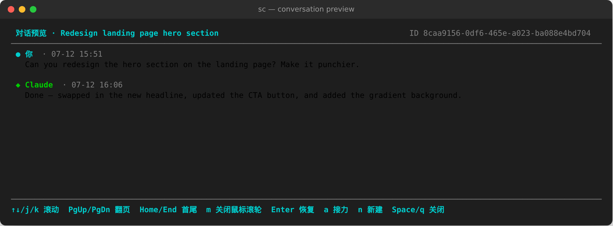

# session-continue

[](https://github.com/x0c/session-continue/actions/workflows/test.yml)
[](LICENSE)

Fast terminal session picker for Claude Code, Codex CLI, and OpenCode.

`session-continue` scans your local Claude Code, Codex CLI, and OpenCode history, shows recent coding sessions in a curses TUI, and lets you resume the selected session in its native runtime. It can also hand off a session from one runtime to another (e.g. Claude to Codex, or OpenCode to Claude) by starting a new target session with a structured pointer to the original history.

Keywords: Claude Code session manager, Codex CLI resume, OpenCode session manager, terminal TUI, AI coding agent workflow, JSONL chat history, cross-runtime handoff.




## Why Use It

- Browse recent Claude Code, Codex CLI, and OpenCode sessions from one terminal screen.
- Resume with the original runtime using native commands such as `claude --resume`, `codex resume`, and `opencode -s <id>`.
- Preview the user messages and final assistant replies before resuming, each with a timestamp when
  the history format has one; the preview page refreshes automatically while a session keeps writing.
- Hand off unfinished work between runtimes without rewriting or faking session files.
- Keep generated titles in a local cache so repeat launches stay fast.
- Use JSON output for scripts and launchers.

## Privacy Model

The tool is local-first.

- It reads local history under `~/.claude/projects/`, `~/.codex/sessions/`, and (read-only) OpenCode's SQLite database at `~/.local/share/opencode/opencode.db`.
- It does not upload session history by itself.
- Cross-runtime handoff passes the original history file path to the target runtime instead of copying the whole conversation into command-line arguments.
- Optional title generation calls your installed `claude` command and may consume Claude account quota.
- Title cache files are stored under `~/.cache/session-continue/`.

See [PRIVACY.md](PRIVACY.md) for the detailed privacy and data-flow notes.

## Requirements

- Python 3.10 or newer.
- macOS or Linux terminal with curses support.
- Claude Code, Codex CLI, and/or OpenCode installed if you want to resume those sessions.

## Install

### Homebrew (macOS/Linux)

```bash
brew install x0c/tap/session-continue
```

### Install Script

```bash
curl -fsSL https://raw.githubusercontent.com/x0c/session-continue/main/install.sh | bash
```

Requires Python 3.10+. Installs via `pip install --user` and prints a `PATH` hint if the install directory isn't already on it.

### From Source

```bash
git clone https://github.com/x0c/session-continue.git
cd session-continue
python3 -m pip install --user .
```

Then run:

```bash
sc
```

### Without Installing

```bash
git clone https://github.com/x0c/session-continue.git
cd session-continue
python3 sc.py
```

You can also add a symlink manually:

```bash
mkdir -p ~/.local/bin
ln -sf "$PWD/sc.py" ~/.local/bin/sc
chmod +x sc.py
```

Make sure `~/.local/bin` is in your `PATH`.

## Usage

```bash
sc                  # open the interactive TUI
sc --limit 30       # show up to 30 sessions per runtime
sc --json           # print sessions as JSON and exit
sc --json --limit 5 # script-friendly small result set
```

JSON output includes runtime, session ID, title, working directory, update time, size, status, resume command, and history path.

## Direct Launch

`sc claude [args...]`, `sc codex [args...]`, and `sc opencode [args...]` start a brand-new session
directly, skipping the TUI. Everything after the runtime name is passed through unchanged to the
underlying command; `sc` only prepends the runtime's auto-approve flag
(`--dangerously-skip-permissions` for Claude, `--dangerously-bypass-approvals-and-sandbox` for Codex)
unless you already included it yourself, and wraps the launch in
[Keep-Alive](#keep-alive-survive-ssh-disconnects) by default.

```bash
sc claude                       # blank auto-approved Claude session, kept alive in the background
sc claude Fix the failing tests # same, with a first instruction passed straight to claude
sc codex resume                 # `codex resume`, auto-approved and kept alive
sc opencode                     # blank OpenCode TUI session, kept alive in the background
sc --no-keepalive claude        # direct launch without the background tmux wrapper
```

OpenCode is the exception: its `--dangerously-skip-permissions` flag is only accepted under
`opencode run`, not the bare TUI command (confirmed by testing the real binary — the flag makes the
bare command exit with a usage error). `sc opencode` never adds it automatically; use
`sc opencode run --dangerously-skip-permissions ...` if you want auto-approval for a non-interactive
run.

## Keep-Alive (survive SSH disconnects)

Sessions started or resumed from the TUI are, by default, wrapped in a dedicated background `tmux`
server (`tmux -L sc-keepalive`, using a bundled config — never your own `~/.tmux.conf`). If your SSH
connection drops or you close your laptop, the underlying `claude`/`codex` process keeps running on
the remote machine. Reopen `sc` and the session shows `后台运行中` (running in background); pressing
`Enter` reattaches instead of starting a competing second process.

- Press `Ctrl-\` (no prefix needed) to detach and return to your shell while the session keeps running;
  the standard `Ctrl-b d` also works.
- Press `x` on a backgrounded session to kill it manually (with a confirmation prompt).
- Idle sessions (no tmux activity) are auto-reaped after 24h by default; tune with
  `SC_KEEPALIVE_IDLE_HOURS` (`0` disables reaping) or set `SC_KEEPALIVE_IDLE_HOURS=0` to keep sessions
  forever. Reaping only closes the background tmux session — history stays on disk.
- Disable keep-alive for a single run with `sc --no-keepalive`, or permanently with `SC_KEEPALIVE=0`.
- Automatically skipped when `tmux` isn't installed, or when `sc` is already running inside a
  `tmux`/`screen` session (no nesting).

## Agent / Automation

`sc` also exposes read-only, structured subcommands meant for AI agents to query local session
history — list, search, inspect, build a handoff context package, and produce a native continuation
plan. None of them launch or resume anything; what to do with the data and plan is left to the
caller.

```bash
sc list --cwd my-app --status pending --top 5 --compact # compact, capped session list
sc search weather app --top 3 --compact                 # relevance-ranked topic search
sc search weather app --deep                            # include full conversation search
sc show <session-id-prefix> --messages 10 --compact     # session detail + recent conversation
sc show <session-id-prefix> --full --out /tmp/sc.json    # write large full output to a file
sc context <session-id-prefix>          # handoff package: history path, suggested prompt, resume command
sc plan continue <runtime:id> --instruction "Continue the remaining work" # argv/cwd plan; does not start it
sc describe [command]                   # machine-readable command/argument/field reference
```

Every command prints a JSON envelope (`{ok, data, error, meta}`) and uses fine-grained exit codes
(`0` success, `2` usage error, `3` not found, `5` ambiguous session reference). Running `sc` with no
subcommand outside a real terminal (piped, scripted, or invoked by an agent) also falls back to a
JSON session list instead of trying to start the curses TUI.

For `list` and `search`, `--limit` is scan depth per runtime and `--top` is the returned result
count cap. `search` returns `score`, `matched_via`, and `matched_fields`; `list`/`search` rows
include `resumable` and `resume_command` so automation can decide whether to resume in place or
start fresh. `sc plan continue` turns that decision into a structured, read-only execution plan
(`argv` and `cwd`), never a shell command string and never a launched process.

See [docs/SKILL.md](docs/SKILL.md) for the full command reference, field semantics, and typical
agent workflows.

## Key Bindings

| Key | Action |
| --- | --- |
| `Up` / `Down` / `j` / `k` | Move selection |
| `Left` / `Right` / `Tab` | Switch runtime column |
| `Space` | Open full-screen conversation preview |
| `Home` / `End` | Jump in preview |
| `Enter` | Resume selected session with the native runtime (reattach if it's already running in the background) |
| `a` | Open advanced handoff actions |
| `x` | Close a backgrounded (keep-alive) session, with confirmation |
| `q` | Close preview/dialog or quit |

`Esc` is intentionally not used as the quit key because terminals also use escape sequences for arrow keys.
Inside a keep-alive session, `Ctrl-\` detaches back to `sc` without ending the process (see [Keep-Alive](#keep-alive-survive-ssh-disconnects)).

## Cross-Runtime Handoff

Native resume is used when the source and target runtime are the same.

When the target runtime is different, `session-continue` creates a new session in the target runtime. The prompt includes:

- source runtime name;
- original session title;
- original working directory;
- original history location (a JSONL file for Claude/Codex, or a SQLite database plus session ID for OpenCode);
- a short format hint for reading that history.

The original session history is left untouched (opened read-only). The target runtime decides what history it needs to read before continuing the work.

## Title Generation

The TUI first shows a local fallback title so the first screen is immediate. A detached background process can then generate better Chinese titles in small batches through `claude -p --model haiku`.

Cost controls:

- generated titles are cached by runtime and session ID;
- a file lock prevents duplicate title-generation workers;
- failures keep the local fallback title instead of retrying every item slowly.

Title generation is optional in practice: if `claude` is unavailable or fails, the session picker still works.

## Project Layout

| Path | Purpose |
| --- | --- |
| `sc.py` | curses TUI, preview screen, JSON output, direct-launch subcommand dispatch, and process handoff |
| `agent_api.py` | read-only `list`/`search`/`show`/`context`/`describe` subcommands for agents |
| `keepalive.py` | tmux-backed launch wrapper: keep-alive on/off detection, wrap/attach launch plans, idle reaping (config for the dedicated tmux server is inlined here, not a separate file — see maintainer notes) |
| `models.py` | shared session, handoff, and launch-plan data models |
| `runtime/` | runtime adapters for scanning, native resume, and new-session launch |
| `scan_claude.py` | Claude Code history scanner |
| `scan_codex.py` | Codex CLI history scanner |
| `scan_opencode.py` | OpenCode history scanner (read-only SQLite queries) |
| `titles.py` | local title fallback, cache, status labels, and batch generation |
| `docs/SKILL.md` | agent-facing command reference (SKILL.md convention) |
| `test_*.py` | unit tests |

## Development

Run the same checks used by CI:

```bash
python3 -m py_compile sc.py scan_claude.py scan_codex.py scan_opencode.py titles.py models.py agent_api.py keepalive.py runtime/*.py test_*.py
python3 -m unittest -v
```

For UI changes, run a real terminal smoke test as well.

Maintainer notes live in [AGENTS.md](AGENTS.md) and [docs/MAINTAINER_GUIDE.md](docs/MAINTAINER_GUIDE.md).

## License

MIT. See [LICENSE](LICENSE).
