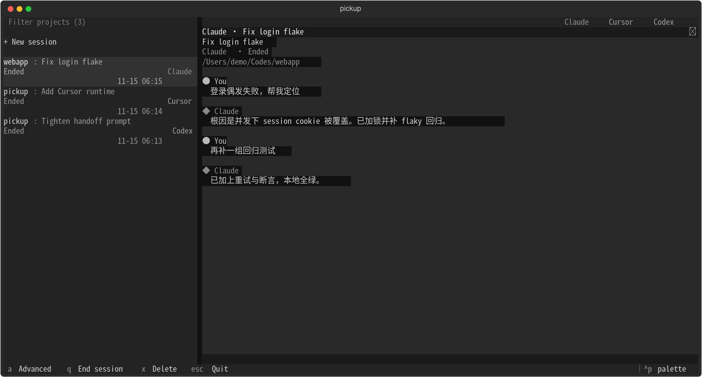

# pickup

[](https://github.com/x0c/pickup/actions/workflows/test.yml)
[](LICENSE)

Fast terminal session picker for Claude Code, Codex CLI, OpenCode, Kimi Code CLI, and Cursor Agent CLI.

`pickup` scans your local Claude Code, Codex CLI, OpenCode, Kimi Code CLI, and Cursor Agent CLI history, shows recent coding sessions in a terminal UI (built with [Textual](https://github.com/Textualize/textual)), and lets you resume the selected session in its native runtime. It can also hand off a session from one runtime to another (e.g. Claude to Codex, or OpenCode to Claude) by starting a new target session with a structured pointer to the original history.

Keywords: Claude Code session manager, Codex CLI resume, OpenCode session manager, Kimi Code CLI session manager, terminal TUI, AI coding agent workflow, JSONL chat history, cross-runtime handoff.



## Why Use It

- Browse recent Claude Code, Codex CLI, OpenCode, Kimi Code CLI, and Cursor Agent CLI sessions from one terminal screen.
- Resume with the original runtime using native commands such as `claude --resume`, `codex resume`, `opencode -s <id>`, and `kimi -S <id>`, and `agent --resume`.
- Select a finished session to preview the full conversation in the right pane (live/hosted sessions show embedded terminals instead), or keep up to three active sessions side by side.
- Hand off unfinished work between runtimes without rewriting or faking session files.
- Reuse a bounded local cache and native hot-path accelerator so repeat launches, previews, and live panes stay fast.
- Use JSON output for scripts and launchers.

## Privacy Model

The tool is local-first.

- It reads local history under `~/.claude/projects/`, `~/.codex/sessions/`, `~/.kimi-code/sessions/`, `~/.cursor/chats/`, and (read-only) OpenCode's SQLite database at `~/.local/share/opencode/opencode.db`.
- It does not upload session history by itself.
- Cross-runtime handoff passes the original history file path to the target runtime instead of copying the whole conversation into command-line arguments.
- Optional title generation calls the preferred installed agent CLI (Claude Code first, then Codex) and may consume its account quota.
- Title and derived performance caches are stored under `~/.cache/pickup/`; they can be inspected or cleared locally.

See [PRIVACY.md](PRIVACY.md) for the detailed privacy and data-flow notes.

## Requirements

- Python 3.10 or newer.
- `tmux` 3.2 or newer (hard requirement — session hosting, embedded panes, and SSH keep-alive are all built on it; `pickup` checks the version at startup and refuses to run on older tmux, since `new-session -e` environment injection requires 3.2+).
- macOS or Linux terminal (any modern ANSI-capable terminal works; the UI is built with Textual, not curses).
- Claude Code, Codex CLI, OpenCode, Kimi Code CLI, and/or Cursor Agent CLI installed if you want to resume those sessions.

## Install

### Homebrew (macOS/Linux)

```bash
brew install x0c/tap/pickup
```

### Install Script

```bash
curl -fsSL https://raw.githubusercontent.com/x0c/pickup/main/install.sh | bash
```

Requires Python 3.10+. On supported macOS/Linux machines the script installs a prebuilt native wheel, falling back to a source build only when no matching wheel exists. It prints a `PATH` hint if the install directory isn't already on it.

### From Source

```bash
git clone https://github.com/x0c/pickup.git
cd pickup
python3 -m pip install --user .
```

Then run:

```bash
pickup
```

### From Source (editable)

```bash
git clone https://github.com/x0c/pickup.git
cd pickup
python3 -m pip install --user -e .
```

Then run:

```bash
pickup
# or: python3 -m pickup
```

Do not run a deleted root-level `pickup.py`; the package lives under `src/pickup/`.

## Usage

```bash
pickup                  # open the interactive TUI
pickup --limit 30       # show up to 30 sessions per runtime
pickup --json           # print sessions as JSON and exit
pickup --json --limit 5 # script-friendly small result set
pickup --no-input       # force non-interactive JSON output
pickup -v               # show version, install path, and install channel
pickup -d               # enable detailed diagnostic logging
pickup -q               # suppress non-essential startup messages
pickup --no-color       # disable colors (also respects NO_COLOR)
pickup update           # manually check for and install the latest version
pickup cache status     # inspect the bounded local performance cache
pickup cache clear      # clear derived metadata and conversation cache
```

Common aliases are supported: `-h` / `--help`, `-v` / `-V` / `--version`,
and `-d` / `--debug` / `--verbose`.

JSON output includes runtime, session ID, title, working directory, update time, size, status, resume command, and history path.

The TUI defaults to English. If your system locale is Chinese (`zh*`), the interface switches to Chinese automatically. Force a language with `PICKUP_LANG=en` or `PICKUP_LANG=zh`.

The derived cache defaults to 256 MiB and invalidates entries whenever the source history changes. Set `PICKUP_CACHE=0` to disable it, `PICKUP_CACHE_MAX_MB` to change its bound, or `PICKUP_NATIVE=0` to force the portable Python fallback for troubleshooting.

## Embedded Panes (work on multiple sessions at once)

`pickup` is a unified, time-ordered session timeline: Claude Code, Codex CLI, OpenCode, Kimi Code,
and Cursor Agent sessions appear in one list rather than separate runtime tabs. Each card uses three
rows for `project: title`, state plus runtime, and update time. Title generation uses a spinner without
changing the title's weight. The right side follows the selection: finished sessions show their full
conversation pinned to the newest message, while hosted sessions render live terminals. The runtime
buttons above the right side can add another agent in the same project, up to three side-by-side panes;
the active pane combination is remembered. Once the list is shown its order is stable — cards never jump
around when their content updates; only genuinely new sessions appear, always prepended at the top.

- The first row is a pinned `+ New session` item (Chinese locale: `＋ 新建会话`) that never scrolls away: press
  `Enter` on it to pick a project directory and an agent runtime, and the blank session starts
  hosted in the right-hand pane.
- Click a runtime button above the right side to add that agent as another pane in the current project.
  Up to three panes may run together; click a pane to focus it and sync the sidebar selection.
- `Enter` resumes the selected session in the right-hand pane (or reconnects an already-hosted
  live terminal there). Keyboard focus stays on the sidebar so browsing shortcuts keep working;
  click the right pane when you want to type into the agent. Moving the selection alone never
  starts an agent.
- Click a session card to do the same thing as `Enter`; click the right pane to interact with it,
  and click back on the left list to return keyboard control to browsing.
- While the right pane has focus, `Ctrl-\` returns keyboard focus to the list. Hosted sessions keep
  running in the background.
- The wheel follows where the mouse is, independent of keyboard focus: over the right pane it
  scrolls conversation preview or live history; over the left sidebar it scrolls the session list.
  At the live edge, agents that request wheel input receive it directly; otherwise pickup browses
  tmux history.
- Drag to select text in the embedded pane, then press `Ctrl+C` to copy it through OSC 52 (including
  over SSH when the terminal supports it).
- `m` (in the list/sidebar) toggles mouse reporting off and on — turn it off when you want
  your terminal's native drag-to-select for a longer copying session; turn it back on to
  resume wheel forwarding and embedded-pane text selection.
- The terminal cursor is parked at the agent's own cursor position, so IME preedit popups
  (e.g. CJK input methods) appear right at the agent's input box, not at the bottom of the screen.
- Dark/light theme detection inside panes is repaired on tmux ≥ 3.5a: `pickup` probes your real
  terminal's background color at startup and feeds it to each hosted pane
  (`refresh-client -r`), so agents that query OSC 11 get the true value. Agents that were
  already running keep their earlier guess — restart them or set their theme manually once.
- `c` closes the focused pane; its hosted session keeps running in the background and can be reopened
  with `Enter`.
- `q` on a backgrounded / in-progress session ends it after a second `q` confirmation;
  quitting `pickup` with `Esc` never kills anything — everything stays alive in tmux.

## Direct Launch

`pickup claude [args...]`, `pickup codex [args...]`, `pickup opencode [args...]`,
`pickup kimi [args...]`, and `pickup cursor [args...]` start a brand-new session.
In a real terminal they open the same sidebar TUI with the new session already hosted and
focused in the right-hand pane; outside a real terminal (piped/scripted) or with
`--no-keepalive` they take over the terminal the classic way instead.

Two forms after the runtime name:

1. **Project shortcut** — first argument does **not** start with `-` (e.g. `pickup claude subswap`):
   fuzzy-match a local project (session history cwds ∪ git roots under `$HOME`, overridable with
   `PICKUP_PROJECT_ROOTS`), then open a blank session in that directory. Multiple matches → numbered
   picker. Extra args after the project name are rejected.
2. **Passthrough** — no args, or first arg starts with `-` (e.g. `pickup claude --resume id`):
   remaining args go straight to the underlying CLI; `pickup` only prepends the runtime's
   auto-approve flag unless you already included it, and hosts with
   [Keep-Alive](#keep-alive-survive-ssh-disconnects).

```bash
pickup claude                       # blank Claude session in the current directory (TUI-hosted)
pickup claude subswap               # blank Claude session in the matched project directory
pickup claude --print "hi"          # passthrough flags/args to claude
pickup codex --resume <id>          # `codex --resume`, auto-approved and hosted in the TUI
pickup opencode                     # blank OpenCode TUI session, hosted in the TUI
pickup kimi                         # blank auto-approved Kimi session, hosted in the TUI
pickup --no-keepalive claude        # classic full-terminal launch without the background tmux wrapper
```

OpenCode is the exception: its `--dangerously-skip-permissions` flag is only accepted under
`opencode run`, not the bare TUI command (confirmed by testing the real binary — the flag makes the
bare command exit with a usage error). `pickup opencode` never adds it automatically; use
`pickup opencode run --dangerously-skip-permissions ...` if you want auto-approval for a non-interactive
run.

## Keep-Alive (survive SSH disconnects)

Sessions started or resumed from the TUI are, by default, wrapped in a dedicated background `tmux`
server (`tmux -L pickup-keepalive`, using a bundled config — never your own `~/.tmux.conf`). If your SSH
connection drops or you close your laptop, the underlying `claude`/`codex` process keeps running on
the remote machine. Reopen `pickup` and the session shows `后台运行中` (running in background); pressing
`Enter` reattaches instead of starting a competing second process.

- Press `Ctrl-\` (no prefix needed) to detach and return to your shell while the session keeps running;
  the standard `Ctrl-b d` also works.
- Press `q` on a backgrounded / in-progress session to end it (press `q` again to confirm).
- Idle sessions (no tmux activity) are auto-reaped after 24h by default; tune with
  `PICKUP_KEEPALIVE_IDLE_HOURS` (`0` disables reaping; the legacy name `SC_KEEPALIVE_IDLE_HOURS`
  still works). Reaping only closes the background tmux session — history stays on disk.
- Disable keep-alive for a single run with `pickup --no-keepalive`, or permanently with
  `PICKUP_KEEPALIVE=0` (legacy `SC_KEEPALIVE=0` also works).
- Keep-alive of the full-screen attach form is skipped when `pickup` is already running inside a
  `tmux`/`screen` session (no nesting); embedded panes don't attach and work fine there.

## Agent / Automation

`pickup` also exposes read-only, structured subcommands meant for AI agents to query local session
history — list, search, inspect, build a handoff context package, and produce a native continuation
plan. None of them launch or resume anything; what to do with the data and plan is left to the
caller.

```bash
pickup list --cwd my-app --status pending --top 5 --compact # compact, capped session list
pickup search weather app --top 3 --compact                 # relevance-ranked topic search
pickup search weather app --deep                            # include full conversation search
pickup show <session-id-prefix> --messages 10 --compact     # session detail + recent conversation
pickup show <session-id-prefix> --full --out /tmp/pickup.json # write large full output to a file
pickup context <session-id-prefix>          # handoff package: history path, suggested prompt, resume command
pickup plan continue <runtime:id> --instruction "Continue the remaining work" # argv/cwd plan; does not start it
pickup describe [command]                   # machine-readable command/argument/field reference
```

Every command prints a JSON envelope (`{ok, data, error, meta}`) and uses fine-grained exit codes
(`0` success, `2` usage error, `3` not found, `5` ambiguous session reference). Running `pickup` with no
subcommand outside a real terminal (piped, scripted, or invoked by an agent) also falls back to a
JSON session list instead of trying to start the terminal UI.

For `list` and `search`, `--limit` is scan depth per runtime and `--top` is the returned result
count cap. `search` returns `score`, `matched_via`, and `matched_fields`; `list`/`search` rows
include `resumable` and `resume_command` so automation can decide whether to resume in place or
start fresh. `pickup plan continue` turns that decision into a structured, read-only execution plan
(`argv` and `cwd`), never a shell command string and never a launched process.

See [docs/SKILL.md](docs/SKILL.md) for the full command reference, field semantics, and typical
agent workflows.

## Key Bindings

| Key | Action |
| --- | --- |
| `Up` / `Down` / `j` / `k` | Move selection |
| `/` | Focus the project search box (case-insensitive fuzzy match on project name and session title) |
| `Enter` | Resume selected session with the native runtime (reattach if it's already running in the background); on the pinned first row `+ New session` (Chinese: `＋ 新建会话`), start the new-session flow instead |
| `a` | Open advanced handoff actions |
| `q` | End a backgrounded / in-progress (keep-alive) session; press `q` again in the confirm dialog |
| `x` | Permanently delete the selected local session; press `x` again in the confirm dialog |
| `c` | Close the focused right-side pane without ending its hosted session |
| `Home` / `End` / `PgUp` / `PgDn` | Scroll the right-pane conversation preview (also mouse wheel over the pane) |
| `F12` | Save a local diagnostic screenshot under `~/.cache/pickup/screenshots/` |
| `Esc` | Clear search / close dialog, or quit |

Click the right pane to type into a hosted agent; `Ctrl-\` returns keyboard focus to the sidebar
without ending the process. Mouse wheel over either pane works regardless of which side has focus.

## Cross-Runtime Handoff

Native resume is used when the source and target runtime are the same.

When the target runtime is different, `pickup` creates a new session in the target runtime. The prompt includes:

- source runtime name;
- original session title;
- original working directory;
- original history location (a JSONL file for Claude/Codex/Kimi, or a SQLite database plus session ID for OpenCode);
- a short format hint for reading that history.

The original session history is left untouched (opened read-only). The target runtime decides what history it needs to read before continuing the work.

## Title Generation

The TUI first shows a local fallback title so the first screen is immediate. A detached background
process can then generate better Chinese titles in small batches through an available Claude or
Codex CLI.

Cost controls:

- generated titles are cached by runtime and session ID;
- a file lock prevents duplicate title-generation workers;
- failed, timed-out, invalid, or missing results keep the local fallback title and stop the spinner;
- a failed title is not retried automatically on later launches, so it does not repeatedly consume
  account quota. A future title-cache upgrade may retry it under updated rules.

Title generation is optional in practice: if no generator is available or generation fails, the
session picker still works.

## Client Auto-Update

Each time the TUI starts, it checks in the background whether a newer release is available (one
HTTPS request to the public GitHub API, see [Privacy Model](#privacy-model)). If your install can be
upgraded in place (Homebrew tap or `pip`-based install), a small notice appears in the bottom-right
corner; click it to update, then optionally restart `pickup` right there. Dismissing it for the day
is one click; it comes back the next day if you're still out of date. Source/dev checkouts are never
nagged — the check is skipped entirely for that install path.

You can also trigger the same check manually at any time, without opening the TUI:

```bash
pickup update
```

## Project Layout

| Path | Purpose |
| --- | --- |
| `src/pickup/` | installable package (src-layout) |
| `src/pickup/cli.py` | process entry, argparse, direct-launch dispatch |
| `src/pickup/store.py` | session store / snapshot refresh |
| `src/pickup/display.py` | width, cards, preview, filtering helpers |
| `src/pickup/theme.py` | OSC probe and runtime label colors |
| `src/pickup/ui/` | Textual UI: main screen, modals, session list, split-pane area, runtime top bar, embed pane |
| `src/pickup/split_layout.py` | remembered active split-pane groups |
| `src/pickup/embed.py` | embedded-pane host (`capture-pane` / `send-keys`) |
| `src/pickup/agent_api.py` | read-only `list`/`search`/`show`/`context`/`describe` |
| `src/pickup/keepalive.py` | tmux-backed keep-alive wrapper |
| `src/pickup/models.py` | shared session / handoff / launch-plan models |
| `src/pickup/runtime/` | runtime adapters |
| `src/pickup/scan/` | per-assistant history scanners |
| `src/pickup/titles.py` / `titlegen.py` | title cache and generators |
| `src/pickup/updater.py` | client auto-update: version check, channel detection, in-place upgrade |
| `tests/` | unit tests |
| `docs/SKILL.md` | agent-facing command reference |

## Development

```bash
python3 -m pip install --user -e .
python3 -m compileall -q src/pickup tests
python3 -m unittest discover -s tests -v
```

For UI changes, run a real terminal smoke test as well (`bash selftest.sh` for embed/keepalive paths).

Maintainer notes live in [AGENTS.md](AGENTS.md) and [docs/MAINTAINER_GUIDE.md](docs/MAINTAINER_GUIDE.md).

## License

MIT. See [LICENSE](LICENSE).
