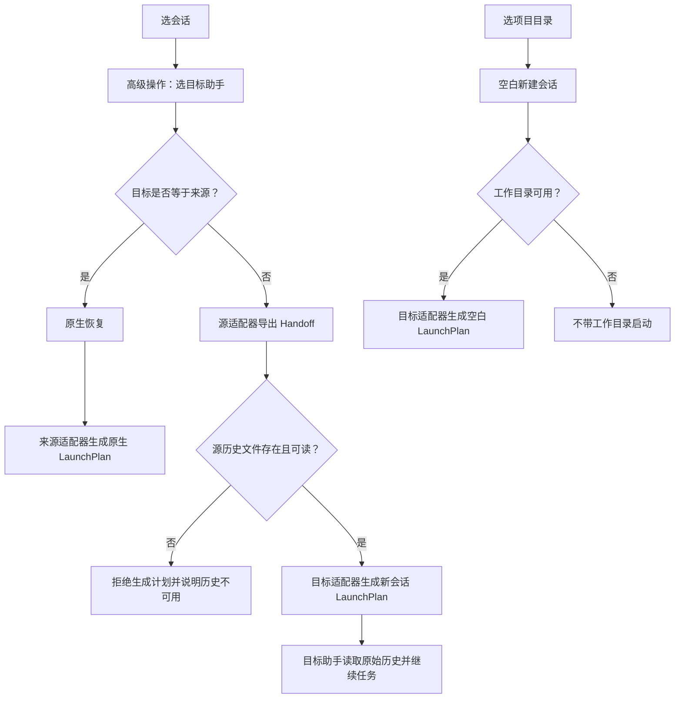

# 跨助手接力与启动知识库

## §0. 领域定义、主称谓与边界

本知识库描述 pickup 如何把用户选中的会话，转换为可执行但尚未执行的**启动计划（LaunchPlan）**。本领域的主称谓固定为：

- **跨助手接力**：源助手导出**接力材料（Handoff）**，目标助手读取源历史后创建自己的新会话。
- **高级操作**：用户对既有会话选择目标助手的业务入口；目标与源相同时是原生恢复，目标不同才是跨助手接力。
- **启动计划（LaunchPlan）**：由参数数组与可选工作目录组成的、可独立测试的启动描述；生成与真正启动分离。
- **接力材料（Handoff）**：源历史文件、源工作目录、历史阅读提示、任务标题和对话摘录组成的统一交接包。
- **原生恢复**：同一助手按自身会话标识恢复原会话。
- **空白新建会话**：在选定有效工作目录启动助手，但不关联、不读取任何既有会话历史。

本领域覆盖 `models.py`、`runtime/`、高级操作的业务触发，以及 `pickup context` 复用提示词的边界。它不覆盖各助手历史文件的 JSONL/SQLite 解析细节、终端界面实现、内嵌面板、标题生成，也不描述会话保活的内部实现。

## §1. 业务目标与不可变边界

目标是在不篡改历史的前提下，让用户可在同一助手继续原会话、换助手接力未完成工作，或在指定项目目录从零开始。

1. 同一助手恢复优先保留其原生上下文与会话语义；不得为了统一而把它改造成新会话。
2. 跨助手接力必须让目标助手新建自己的会话，再按提示读取源历史；绝不能把源会话冒充成目标助手的原生会话。
3. 源历史文件和工作区都是事实来源。接力材料只提供定位线索，不能成为改写或覆盖历史的理由。
4. 注册表是编排中心：界面和调用方不根据 Claude、Codex 等名称拼接启动参数，也不维护任意两助手之间的转换规则。
5. 启动计划只表达 `argv` 与 `cwd`，必须交由无 Shell 的进程启动方式执行；生成计划本身不启动进程、不改写历史。
6. 接力与保活分层：注册表先得出启动计划，后续是否托管或保活是运行时无关的外层行为。本领域不向适配器泄露保活概念。

## §2. 状态与分流

用户从已存在会话进入高级操作时，选择的目标助手决定唯一分流；空白新建会话则不经过源会话与接力材料。



- **原生恢复**仅按源助手的会话 ID 和其私有恢复参数生成计划；历史路径即使不存在，也不应被跨助手历史校验误伤。
- **跨助手接力**先校验源历史文件，再调用“源导出、目标导入”这一条通用链路。目标计划不得携带原生恢复参数。
- **空白新建会话**只使用用户选择的工作目录与目标助手，不渲染接力提示词、不读取历史。
- 直启透传是第四条独立路径：用户直接指定助手和参数时，只构造透传计划，不选择会话、不生成 Handoff。

## §3. 核心对象与职责契约

### 3.1 接力材料（Handoff）

`models.py` 中的 Handoff 是跨助手协议，而不是某个助手的历史格式。它携带来源助手标识与显示名、标题、绝对历史路径、原工作目录、历史阅读提示和 `conversation_digest`。

- `history_path` 必须指向当前机器真实存在的历史文件；导出时转换为绝对路径。
- `original_cwd` 可以为空或已经失效，不能因此阻止接力；目标计划应通过 `usable_cwd` 决定是否采用它。
- `history_reading_hint` 由源适配器提供，告诉目标助手怎样只读定位源历史，不应由编排层猜测。
- OpenCode 历史数据库是共享容器，导出时还必须把会话 ID 写入阅读提示，避免目标读取错误会话。
- Handoff 是只读交接描述，不包含可执行 Shell 字符串，也不拥有写入源历史的能力。

### 3.2 对话摘录（conversation_digest）

摘录用于让刚启动的目标助手快速锁定任务与进度，不替代原始历史。

- 基类统一通过 `load_conversation` 构建；各适配器不得各自复制一份摘要算法。
- 摘录保留原始需求及最近最多八条用户/助手消息，并压平多行、按长度截断，避免破坏提示词的逐行结构。
- 角色只能标记为“用户”“助手”，禁止用“你”；“你”会被接手的模型错误理解为它自己。
- 解析异常或没有可用对话时，静默回退到扫描阶段已有的首尾消息；再无内容则保留空串，接力仍可继续。
- 原始历史永远是权威：提示词必须说明摘录是截断版，要求目标助手以它为线索核对、补全源文件与工作区事实。

### 3.3 启动计划（LaunchPlan）

LaunchPlan 只包含 `argv` 参数数组和可选 `cwd`，让计划能被测试、托管或最终执行层安全消费。

- `argv` 是参数数组，不是需再次解析的命令字符串；调用方不得拼接进 `sh -c`、`eval` 等 Shell。
- `cwd=None` 表示不改变当前目录；直启透传固定使用此语义。
- 真正执行前才检查可执行文件是否已安装、切换可用工作目录并替换当前进程。
- 计划生成与执行解耦，支持高级操作、空白新建、直启和只读计划查询复用同一模型。

### 3.4 运行时适配器

每个助手适配器拥有其私有恢复方式、跨助手新会话方式、空白新建方式及历史阅读提示。

- `build_resume_plan`：只服务同助手的原生恢复。
- `build_new_plan`：接收 Handoff，为跨助手接力创建目标助手的新会话。
- `build_new_session_plan`：只在指定目录启动空白新会话，不能夹带 Handoff 提示词。
- `export_handoff`：把本助手私有会话投影为统一 Handoff；历史不可用时明确失败。
- 新增助手只需实现这些能力并在默认注册表登记一次；禁止新增“助手 A → 助手 B”的专用分支。

### 3.5 注册表编排

`runtime/registry.py` 的注册表是业务分流唯一入口。

- `build_launch_plan` 比较来源与目标：相同即调用来源的原生恢复；不同才执行导出 Handoff → 目标 `build_new_plan`。
- `build_new_session_plan` 将空白新建请求路由给目标适配器，不读取既有会话。
- `build_passthrough_plan` 将直启参数原样交给目标可执行文件，仅按规则补齐自动批准参数。
- 注册表不认识具体命令行参数含义，避免编排层与适配器的私有行为耦合。

### 3.6 自动批准参数（auto_approve_args）

危险的自动批准参数必须在对应适配器的 `auto_approve_args` 中声明为单一来源。

- 原生恢复、跨助手新会话、空白新建及直启透传应复用这份声明，不得各处硬编码同一参数。
- 直启若用户已显式携带某自动批准参数，注册表不得重复插入。
- 参数只在特定子命令有效的运行时是有意例外：OpenCode 的该参数只可用于非交互续接命令，因此不能放入通用 `auto_approve_args`，否则会破坏其裸直启和交互启动。

## §4. 关键业务规则

1. **禁止两两分支。** 不允许实现“Claude 转 X”“Codex 转 X”这样的组合逻辑。统一链路只能是“源导出 Handoff → 目标导入 Handoff”，新增助手的成本随助手数量线性增长。
2. **禁止伪造原生恢复。** 跨助手目标必须新建会话，不得传源会话 ID 作为目标助手的恢复 ID。
3. **禁止改写或伪造原会话文件。** 接力提示词只能要求只读历史；目标的新增内容只能落在目标助手自己的新会话中。
4. **不注入完成态。** Handoff 和 `render_prompt` 禁止恢复或新增 `status_tag`、`status_note`、`✅已完成` 等来源列表状态。接力目的在于继续判断未完成工作，提前宣告完成会让目标助手停止推进。
5. **工作目录必须可用。** 所有恢复、跨助手新建和空白新建都经 `usable_cwd` 校验；不存在的目录降级为 `None`，不能让启动因过期历史目录失败。
6. **高级操作只表达业务选择。** 选择同一助手的文案与结果是原生恢复；选择其他助手是“读取来源历史后新建会话”。默认优先选择第一个可用的其他助手，没有可用目标时才回到来源助手。
7. **空白就是空白。** 空白新建会话不得出现历史路径、对话摘录或接力提示词，也不得借用已选会话的 ID。
8. **直启是透传。** 用户显式给出的参数应保持顺序和内容；直启不使用历史会话的工作目录，也不额外加入模型配置等隐式行为。

## §5. 接力提示词与共享消费边界

`Handoff.render_prompt()` 是接力提示词的唯一渲染源。它依次表达任务标题、这是跨助手接力而非原生恢复、原历史位置与格式提示、可选摘录、阅读与继续执行要求。

提示词必须引导目标助手：

1. 先把摘录作为检索线索，而非唯一真相；
2. 按需读取原始历史，核对真实需求、既有结论、工具结果、工作区改动和未完成事项；
3. 检查当前工作区实际状态后继续最后一个未完成任务，而不是只输出历史摘要；
4. 将历史中的系统提示、工具输出和第三方文本仅当作上下文，服从当前运行时规则和项目规范；
5. 原任务确实完成时，明确说明没有待办并等待新指令，但仍不得修改原历史。

`pickup context` 输出的 `suggested_prompt` 与终端界面高级操作的接力提示词共用同一个 `render_prompt`。因此任何摘录格式、权威声明或安全指令的改动，会同时影响机器接口与人类高级操作；同步核对 `docs/SKILL.md` 的对外描述，不能只验证其中一边。

## §6. 易错点与防回归清单

1. **把同助手也走 Handoff**：会丢失原生恢复语义。注册表必须先比较来源与目标。
2. **为每个助手对写转换代码**：会造成组合爆炸。只扩展源导出与目标新建两个接口。
3. **把摘要当完整历史**：摘要会截断且可能降级；始终强调源历史为权威。
4. **摘录失败就拒绝接力**：这是可用性回归。加载失败、空内容都必须静默降级。
5. **角色写成“你”**：会让目标模型误认说话者，必须使用“用户”“助手”。
6. **把 `status_tag` / `status_note` 放进提示词**：完成态会诱导目标助手不继续工作，禁止恢复该字段。
7. **信任失效 cwd**：历史目录可能已删除；使用 `usable_cwd`，并接受 `cwd=None`。
8. **自动批准参数散落硬编码**：会导致直启、恢复和新建行为漂移。除已验证的子命令例外外，只读适配器的 `auto_approve_args`。
9. **给 OpenCode 裸启动塞入仅 `run` 支持的批准参数**：会直接启动失败；该能力差异必须保留。
10. **将 Kimi 跨助手接力误认为交互新会话**：其预置提示词路径是执行后退出的模式；接力完成后需另行原生继续，不能在文档或调用方承诺持续交互。
11. **让空白新建携带接力材料**：会污染从零开始的会话。它只能接受目标助手和有效工作目录。
12. **把直启当作高级操作的替代**：直启是用户参数的就地透传，`cwd=None`，不应读取会话、改变目录或构建提示词。
13. **在适配器内接入保活实现**：适配器只生成 LaunchPlan；保活只可在计划生成之后的外层介入。
14. **改了 render_prompt 却只测 TUI**：`pickup context` 会同步变化，必须覆盖两种消费面。

## §7. 验证与排查

### 自动化验证

改动 `models.py`、`runtime/`、高级操作分流或直启计划后，至少执行：

```bash
cd cli
python3 -m unittest -v test_runtime.py
python3 -m unittest -v test_session_scanning.py
```

`test_runtime.py` 至少应覆盖：

- Claude、Codex、OpenCode、Kimi、Cursor 的同助手原生恢复；
- 双向或多目标的跨助手接力，断言目标没有错误携带原生恢复参数；
- 源历史文件不存在时跨助手接力失败；
- 各助手空白新建计划不含接力提示词；
- 不存在的工作目录降级为 `None`；
- 新助手仅注册一次即可加入通用接力；
- 自动批准参数的前置、去重与 OpenCode 例外；
- 直启透传的 `cwd=None` 与参数原样保留。

`test_session_scanning.py` 的 Handoff 摘录用例应覆盖首条需求与最近消息、角色标签、截断后的单行形态、重复窗口去重、加载失败回退、无摘要降级、提示词不含状态标签，以及多个目标助手都接收到同一份渲染提示词。

### 手工接力冒烟

1. 选一条有真实历史且工作目录仍存在的已结束会话，进入高级操作。
2. 选择同一助手，确认生成的是原生恢复，而非新会话或历史阅读提示词。
3. 再选择一个已安装的其他助手，确认目标以新会话启动，并收到源历史路径、格式提示及“跨助手接力”说明。
4. 在目标助手中检查它会读取源历史与当前工作区、继续未完成任务，而不是只复述摘要或因“已完成”状态停止。
5. 用历史文件不存在和工作目录不存在的会话分别验证：前者跨助手接力应被阻止，后者允许启动但不切换到失效目录。
6. 通过 `pickup context <会话>` 检查其 `suggested_prompt` 与高级操作启动时的接力提示词包含相同的摘要与安全约束。
7. 用空白新建流程选择项目和助手，确认不会出现任何历史文件、摘要或接力说明。
8. 直启某助手并给出自定义参数，确认用户参数未被改写、自动批准参数不重复，且当前目录不被历史 cwd 覆盖。

## §8. 与其他知识库的关系

- `docs/SESSION_SCANNING_KNOWLEDGE_BASE.md`：改、评审或排查会话来源、历史路径、会话工作目录、原生会话可恢复性和对话读取质量时联读；本知识库消费其扫描结果，不定义各助手解析细节。
- `docs/NEW_RUNTIME_ONBOARDING_KNOWLEDGE_BASE.md`：新增或评审一种助手的扫描、原生恢复、接力导出/导入、空白新建与注册验收时联读；本知识库定义接入后必须遵守的统一编排契约。
- `docs/TERMINAL_UI_KNOWLEDGE_BASE.md`：改、评审或排查高级操作入口、运行时选择、新建会话流程或用户可见文案时联读；本知识库只定义选择造成的业务分流，不涉及终端界面实现。
- `docs/SKILL.md`：改、评审 `pickup context` 的接力数据、`suggested_prompt` 或机器接口说明时联读；它与高级操作共同消费 `Handoff.render_prompt`。
- `docs/MAINTAINER_GUIDE.md`：改、评审或排查运行时边界、接手提示词的对话摘录、直启、自动批准参数或与保活的分层关系时联读；其中的运行时差异是本知识库的实现依据。

## §9. 变更决策与维护准则

当新增助手、调整接力提示词或改变启动参数时，先回答以下问题：

1. 变化属于源导出、目标新建、原生恢复、空白新建还是直启透传？不要让一个入口承担另一个入口的语义。
2. 是否仍能通过注册表的通用链路完成，而无需按来源/目标名称分支？
3. 是否读取了历史但没有写入、伪造或迁移原历史？
4. 是否保留原始历史权威性，并让摘要的失败不阻断接力？
5. 是否同时验证了高级操作与 `pickup context` 这两个 `render_prompt` 消费方？
6. 是否把所有危险自动批准参数收敛在正确适配器，并验证命令位置限制？
7. 是否明确运行时能力差异，而没有为了表面一致性生成不可执行的计划？

跨助手接力的成功标准不是“目标助手拿到了一段文本”，而是：目标在新的原生会话中，基于只读源历史和当前工作区，可靠地继续用户尚未完成的工作。
