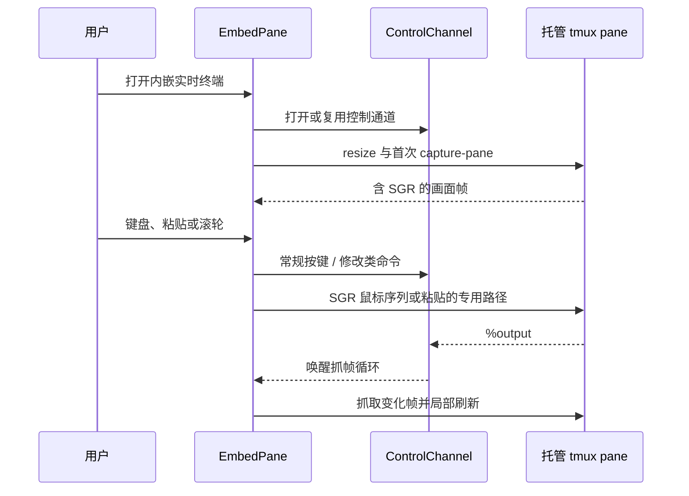
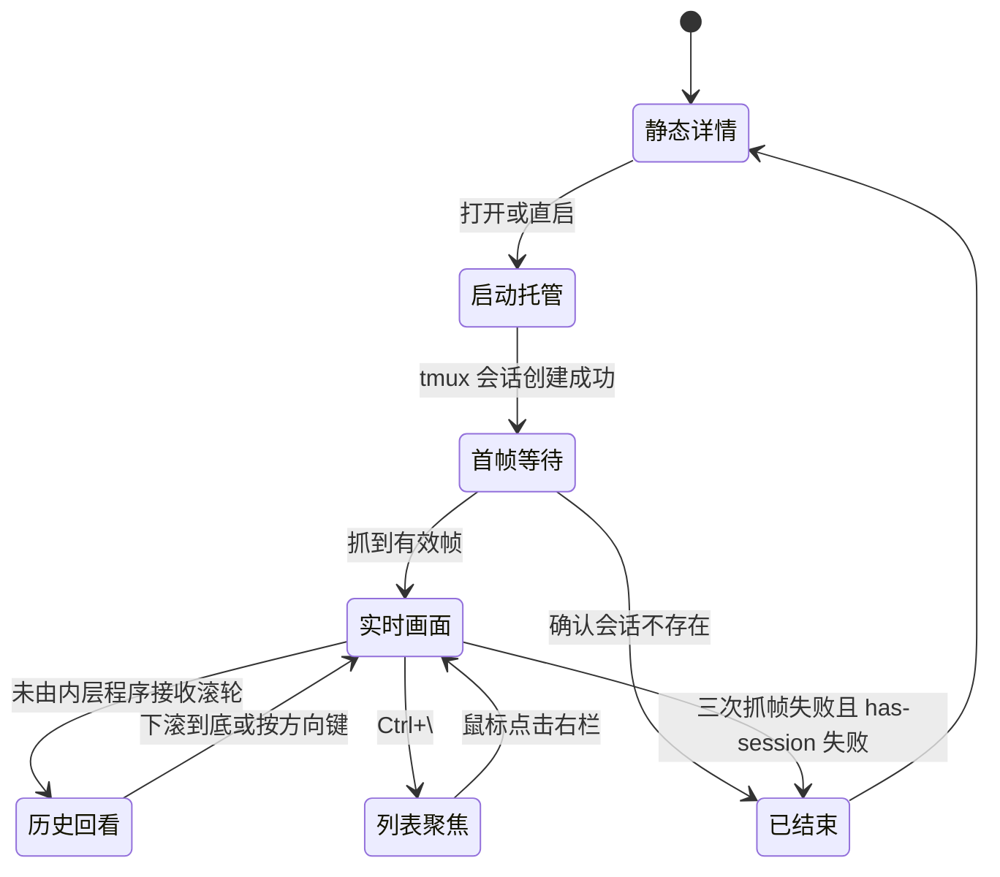

# 内嵌实时终端领域知识库

## §0 目录索引

| § | 标题 | 定位 |
|---|------|------|
| §1 | 业务背景与核心概念 | 首次接触内嵌实时终端时读 |
| §1.5 | 架构概览 | 快速建立托管、抓帧与输入链路认知 |
| §2 | 核心业务流程 / 状态机 | 理解打开、交互、结束与回退路径 |
| §2.5 | 物理路径速查 | 直接定位实现和验收文件 |
| §3 | 代码入口索引 | 按改动场景找入口 |
| §4 | 表与字段入口索引 | 确认本域无业务数据库及运行时命名 |
| §5 | 流程 / 组件 / 任务 / MQ 入口索引 | 理解本域运行时组件 |
| §6 | 核心业务规则与隐性约束 | 改动前必扫的 AI 易错点 |
| §7 | 验证路径 | 单测、端到端自测与用户验收 |
| §8 | 关联文档 | 跨域联读指引 |
| §9 | 覆盖度与待补充项 | 了解证据边界和缺口 |

## §1 业务背景与核心概念

内嵌实时终端把“运行中(托管)”的助手会话画面放进终端界面的右栏，让用户保留会话列表、同时看见并操作正在运行的助手。键盘焦点默认留在侧边栏；只有鼠标点到右栏才与内嵌会话交互。滚轮按鼠标所在位置处理，与焦点无关。这不是另一套会话或终端模拟器，而是同一份后台 tmux 会话的观看与交互方式。

本域只负责运行时画面和交互：

- **内嵌实时终端**（代码别名 `embed`、`EmbedPane`、`capture-pane`）：不执行 tmux attach；抓取 tmux 已经渲染好的屏幕，再把按键、粘贴和部分滚轮动作发送回原 pane。
- **运行中(托管)**（`host_session`）：启动计划被放入专用 tmux 会话后持续运行。关闭右栏或退出 pickup 不会停止它。
- **会话保活**（`keepalive`）：提供独立 tmux socket、会话命名、环境注入、状态标注和回收；本域依赖它，但不定义其回收策略。
- **控制通道**（`ControlChannel`）：常驻的 `tmux -C attach` 客户端。它降低输入和抓帧延迟，并把 pane 输出变成抓帧唤醒信号。
- **焦点边界**：侧边栏选中、回车恢复、新建/直启托管成功后，只更新右栏画面，不抢键盘焦点；鼠标点击右栏才聚焦内嵌面板。滚轮始终按命中区处理。

边界：不讨论 Textual 左栏、搜索、卡片布局；不讨论各助手的 JSONL 扫描、标题生成、机器接口，或从零接入新的助手。运行时适配器也不应感知本域。

## §1.5 架构概览

```mermaid
graph TD
    A[用户选中运行中会话或启动会话] --> B[MainScreen]
    B -->|后台创建| C[embed.host_session]
    C --> D[tmux -L pickup-keepalive]
    D --> E[运行中(托管)助手 pane]
    B --> F[EmbedPane]
    F -->|open_channel| G[ControlChannel: tmux -C attach]
    F -->|capture-pane -p -e| E
    E -->|SGR 屏幕帧| F
    F -->|按键/粘贴/滚轮| G
    G -->|命令或输出通知| D
```



## §2 核心业务流程 / 状态机

### 打开、抓帧、输入和结束

1. 用户在终端界面中打开一个会话。已有“运行中(托管)”会话直接由 `EmbedPane.focus_session()` 聚焦；需要启动的计划由 `MainScreen._embed_open()` 在后台调用 `embed.host_session()`。
2. `host_session()` 用会话保活的专用 socket 建立 detached tmux 会话，名称来自运行时和会话标识；同时按 pane 实际宽高创建，避免先以默认终端尺寸启动造成重排。
3. 新建时注入 `PICKUP_RUNTIME`、`PICKUP_SESSION_ID` 及旧名兼容变量。若外层终端已探得背景色且 tmux 支持，立即打开控制通道并注入颜色应答，缩短助手首轮主题检测的竞态窗口。
4. `EmbedPane` 打开与当前会话对应的控制通道、调整 pane 尺寸，并在后台抓帧循环中调用 `capture()`。控制通道可用时，`%output` 立即唤醒抓帧；空闲时仍低频轮询兜底。
5. 抓到的 `capture-pane -p -e` 输出包含 SGR 样式。`parse_screen()` 解析为单元格网格，`EmbedPane` 逐行比较，只刷新改变的行。首帧未到时不展示“连接中…”，有详情则继续展示详情（**必须钉在最新消息**，禁止 `to_strips(..., height=pane_h)` 顶裁出最早消息），否则展示空白终端画布。
6. 可打印字符和特殊键转发到原 pane；粘贴使用 tmux buffer；滚轮按 pane 是否声明鼠标捕获决定转发 SGR 序列或查看应用层历史。用户切回列表不影响后台会话。
7. 连续三次抓帧失败后，只有 `has-session` 也确认会话不存在才认定结束，右栏显示已结束并收回焦点相关状态。控制通道死亡本身不等于会话死亡：所有调用先自动回退外部 tmux 子进程路径。

### 视图状态



### 输入与滚动分流

- 普通字符经 `send_literal()` 原样发送；特殊键经 `translate_textual_key()` 转成 tmux 键名后由 `send_key()` 发送。仅在右栏持有键盘焦点时转发。
- `Ctrl+C` 有选中文本时复制；没有选区时发送给助手中断运行，不能让终端界面自身退出。
- 粘贴走 `set-buffer` + `paste-buffer -p`，保留 bracketed paste 语义。
- pane 声明鼠标捕获时，滚轮以 press-only SGR 鼠标序列转发，并由后台队列限速、积压丢旧；否则滚轮调整 `history_offset`，以 `capture-pane -S/-E` 抓取真实历史窗口。
- 滚轮命中右栏即处理，不要求右栏持有键盘焦点；命中左栏则滚会话列表。
- 鼠标拖拽选词与复制由 Textual 的原生文本选择完成；本版不把点击、拖拽操作转发给内层程序。

### 运行时状态的所有权

| 状态 | 持有者 | 更新来源 | 使用者 | 失效方式 |
|---|---|---|---|---|
| 当前托管会话名 | `EmbedPane.session_name` | 聚焦、切换、清空 | 抓帧、输入、渲染 | 切换详情或清空时置空 |
| 抓帧代次 | `EmbedPane._capture_generation` | 每次切换实时 / 详情视图 | 后台线程回调 | 回调必须同时匹配代次和会话名 |
| 实时画面网格 | `EmbedPane._grid` | 后台抓帧解析后回写主线程 | Line API 渲染 | 切会话、切详情或尺寸变化后重建 |
| 行级渲染缓存 | `EmbedPane._strips` | `_sync_strips()` | `render_line()` | 仅变化行更新；形状改变整屏重建 |
| pane 光标与鼠标标志 | 后台抓帧缓存 | `pane_state()`，最高 5Hz | 光标锚定、滚轮分流 | 查询失败暂用上次状态，换会话清空 |
| 应用层历史偏移 | `EmbedPane.history_offset` | 滚轮 / 方向键 | 下一次抓帧参数 | 输入或方向键回直播时归零 |
| 静态详情偏移 | `EmbedPane.detail_offset` | 静态预览滚轮、翻页键 | 静态详情渲染 | 切换实时 / 详情时归零 |
| 控制通道 | `embed._channels` 按会话名的通道池 | `open_channel(name)` / `close_channel(name=None)` | 高速输入、事件驱动抓帧；多分屏可同时各持一条 | 关指定格、卸载、死亡、超时，或应用退出时关全部 |

这张表反映两个不能合并的“滚动”概念：实时画面以底部为零、向上增加 `history_offset`；静态对话预览以顶部为零、向下增加 `detail_offset`。二者符号相反，混用会造成已结束会话的滚轮方向反转。

### 控制通道的响应协议

控制通道既服务同步读取，也服务不等待结果的修改命令。tmux 的控制模式对每个命令产生一个 `%begin … %end` 或 `%error` 块；模块以写入顺序维护 FIFO。

| 阶段 | 正确处理 | 防止的问题 |
|---|---|---|
| 创建通道 | 先把 attach 启动响应预留为首个等待者 | 第一条业务请求错拿 attach 的结束响应 |
| 写入命令 | 在同一把锁内先登记等待者、再写 stdin 并 flush | 响应先到而等待者尚未登记 |
| 读取响应 | 用时间戳和命令号匹配完整守卫块 | pane 正文恰好以 `%error` / `%end` 开头而被误判 |
| 接收 `%output` | 不混入请求正文，只唤醒抓帧循环 | 画面内容污染或错失低延迟刷新 |
| 接收 `%pause` | 经同一通道发送继续命令 | tmux 暂停输出后画面永久不再刷新 |
| 请求超时 | 关闭整条通道，唤醒队列和正在处理的请求 | 迟到响应被交给下一条请求 |
| 通道结束 | 标记死亡并回退外部 tmux 调用 | 因一个控制客户端结束误判助手会话结束 |

### 主题、背景与光标的时序

1. 启动 pickup 时，外层终端仍未被 Textual 接管，`pickup.py` 探测 OSC 10 / OSC 11 应答。
2. 创建“运行中(托管)”会话时，`host_session()` 用 pane 实际尺寸启动目标助手，并记录 tmux pane 标识。
3. 对支持 `refresh-client -r` 的 tmux，立即保持控制通道并向该 pane 报告外层颜色。此操作只会让**后续**背景色查询得到正确应答。
4. `EmbedPane.on_mount()` 还会把外层背景 RGB 设置为自身底色；这是视觉底色，不等同于上一步让助手决定深浅主题的报告。
5. 抓帧拿到 pane 光标后，`EmbedPane._update_app_cursor()` 将 pane 内局部坐标换算为屏幕绝对坐标，并显式显示真实光标。只移动隐藏光标不足以支持 IME。

这里存在不可完全消除的启动竞态：助手可能在颜色注入到达前完成首次查询；后续注入不能改变已使用的结果。不能为了追求绝对消除竞态而先启动占位程序再 respawn pane，因为 respawn 会换掉 pty 并丢失已注入的状态。

## §2.5 物理路径速查

| 路径（相对 `cli/` 项目根） | 内容 | 关键文件 / 符号 |
|---|---|---|
| `embed.py` | tmux 托管、抓帧、控制通道、输入、颜色与 SGR 解析 | `host_session()`、`capture()`、`ControlChannel`、`parse_screen()` |
| `ui/embed_pane.py` | 右栏内嵌实时终端 widget、后台抓帧、输入和滚动 | `EmbedPane`、`_capture_loop()`、`_on_key()` |
| `ui/main_screen.py` | 终端界面挂接、异步托管启动和关闭分栏 | `MainScreen._embed_open()`、`_on_embed_hosted()` |
| `src/pickup/cli.py` 等 | 启动接线、tmux 硬依赖检查、外层背景色探测 | `_require_tmux()`、`_probe_osc_colours()` |
| `keepalive.py` | 专用 socket、命名空间、环境变量、状态标注和回收 | `_BASE_ARGV`、`_session_name()`、`annotate()` |
| `test_embed.py` | 单元与真实 tmux 控制通道测试 | `ControlChannelProtocolTests`、`ControlChannelIntegrationTests` |
| `selftest.sh` | 隔离 HOME / tmux 的真实终端端到端验收 | 内嵌、输入、焦点、光标、复制验证 |

## §3 本域代码入口索引

| 场景 | 入口 | 类 / 方法 / 配置 | 说明 |
|---|---|---|---|
| 创建运行中(托管)会话 | `embed.py` | `host_session()` | detached 创建专用 socket 会话，带尺寸、工作目录、环境与同名复用 |
| 打开或接回右栏会话 | `ui/main_screen.py` | `MainScreen._embed_open()`、`MainScreen._on_embed_hosted()` | 在后台完成阻塞创建，成功后更新右栏画面且不抢键盘焦点 |
| 聚焦实时画面 | `ui/embed_pane.py` | `EmbedPane.focus_session()` | 切会话、开控制通道、调整尺寸、启动首帧抓取；不自动抢键盘焦点 |
| 抓取实时画面 | `embed.py` | `capture()`、`pane_state()` | 优先经控制通道请求，失效时回退外部只读 tmux 调用 |
| 控制通道协议 | `embed.py` | `ControlChannel.request()`、`command()`、`close()` | FIFO 对应命令响应、处理 `%output` / `%pause` / `%exit`、可幂等关闭 |
| 常规输入 | `ui/embed_pane.py` | `EmbedPane._on_key()`、`_on_paste()` | 文本、特殊键、Ctrl+C、Ctrl+\ 和粘贴的用户语义分流；仅右栏聚焦时生效 |
| 剪贴板图片粘贴 | `embed.py` | `extract_pasted_image()`、`save_image_and_paste_path()`、`_pane_cwd()` | 识别哨兵包裹的 base64 图片、落盘、经 `paste()` 把路径喂给聚焦中的 agent；由 `EmbedPane._on_paste()` 分流调用（后台 worker，见 `_paste_image_worker`） |
| 鼠标滚轮与历史 | `ui/embed_pane.py` | `EmbedPane._wheel()`、`_scroll()` | 按鼠标命中区处理，与键盘焦点无关；转发鼠标或变更应用层回滚偏移 |
| 鼠标后台发送 | `embed.py` | `send_mouse_sequence()`、`_wheel_send_loop()` | 发送 SGR 滚轮序列、限速并在队列饱和时丢弃旧事件 |
| 屏幕解析与真彩色 | `embed.py` | `parse_screen()`、`_SgrState.apply()`、`cell_style()` | 解析 SGR；RGB 直接交给 Rich，保留宽字符和组合字符 |
| 背景色与主题 | `embed.py` | `report_theme()`、`supports_theme_report()` | 向新建 pane 注入外层 OSC 10/11 应答，恢复助手深浅色判断 |
| 会话结束回退 | `ui/embed_pane.py` | `EmbedPane._capture_loop()`、`_apply_dead()` | 三次失败再确认会话存在性，避免瞬时超时抢走焦点 |

## §4 本域表与字段入口索引

本域没有业务数据库、业务表或业务字段；画面、会话状态和控制通道均是进程内 / tmux 运行时状态。

| 运行时标识 | 语义 | 兼容与改动注意 |
|---|---|---|
| `tmux -L pickup-keepalive` | 会话保活与内嵌实时终端共用的专用 socket | 不得改用用户默认 tmux socket，也不得影响用户手动会话 |
| `pickup-<runtime>-<ident>` | 新建运行中(托管)会话名称 | 新建必须使用 `pickup-` 前缀 |
| `sc-<runtime>-<ident>` | 改名前遗留的托管会话名称 | 必须继续识别、标注和回收，不能删兼容分支 |
| `PICKUP_RUNTIME` / `PICKUP_SESSION_ID` | 注入 pane 的运行时与会话标识 | 新名称是主路径 |
| `SC_RUNTIME` / `SC_SESSION_ID` | 上述标识的旧名称 | 创建托管会话时继续注入 |
| `PICKUP_KEEPALIVE` / `SC_KEEPALIVE` | 禁用会话保活和内嵌可用性的开关 | 任一值为 `0` 都应生效 |
| `PICKUP_KEEPALIVE_IDLE_HOURS` / `SC_KEEPALIVE_IDLE_HOURS` | 会话保活的空闲回收时长 | 属于会话保活域，本域只需保持同一命名与兼容 |

## §5 本域流程 / 组件 / 任务 / MQ 入口索引

| 类型 | 标识 | 代码入口 | 适用场景 |
|---|---|---|---|
| tmux socket | `pickup-keepalive` | `keepalive._BASE_ARGV` | 隔离托管会话与用户默认 tmux 环境 |
| 托管会话 | `pickup-*`、`sc-*` | `embed.host_session()`、`keepalive._session_name()` | 创建、接回、标注与回收同一会话 |
| 控制客户端 | `tmux -C attach` | `embed.ControlChannel` | 高频按键、窗口调整、事件驱动抓帧和主题报告 |
| 抓帧通道 | `capture-pane -p -e` | `embed.capture()` | 获取 tmux 已渲染的含 SGR 画面 |
| pane 状态查询 | `display-message` | `embed.pane_state()` | 光标、鼠标捕获、历史大小等低频状态 |
| 输入缓冲区 | `pickup-embed` | `embed.paste()` | 多行粘贴并保留 bracketed paste |
| 鼠标发送队列 | 每会话有界队列 | `embed.send_mouse_sequence()` | 触控板高频滚动下避免卡住终端界面 |
| 本地异常记录 | `~/.cache/pickup/embed-error.log` | `pickup._log_embed_error()` | 抓帧线程异常后定位问题，线程继续自愈 |

## §6 核心业务规则与隐性约束

- **AI 易错点**【禁止】用 tmux attach 来实现右栏显示 -> 必须以 `capture-pane` 抓画面、以输入转发操作原 pane（原因：attach 会接管终端，破坏终端界面左右分栏与多会话切换）。
- **AI 易错点**【隐性依赖】内嵌实时终端与会话保活必须共用专用 socket 和 `pickup-*` / `sc-*` 命名空间，否则已托管会话无法被正确接回、标注或回收。
- **AI 易错点**【禁止】控制通道存活时让外部 tmux 子进程并发执行修改类命令 -> 必须走 `ControlChannel.command()`（原因：已知 tmux 服务端并发修改风险）；只读抓帧和状态查询可经 `request()`，通道失效才回退外部调用。
- **AI 易错点**【隐性依赖】控制通道启动后，必须先消费 attach 自身完整响应并确认 ready，业务命令才可入 FIFO；请求超时必须关闭通道（原因：未消费启动响应或继续复用超时通道都会使后续响应错配）。
- **AI 易错点**【禁止】把抓帧、pane 状态查询或鼠标发送放在 Textual 主线程 -> 必须由后台抓帧循环或鼠标发送队列完成（原因：tmux 调用会阻塞，触控板滚轮会导致界面卡顿）。
- **AI 易错点**【禁止】用 tmux copy-mode 的 client 滚动位置实现右栏历史 -> 必须维护 `history_offset` 并用 `capture-pane -S/-E` 抓历史窗口（原因：copy-mode 的视觉偏移不影响 capture-pane，画面不会滚动）。
- **AI 易错点**【禁止】把 `history_offset` 命名成 `scroll_offset` -> 后者是 Textual widget 的内置二维属性，覆盖后会令选区坐标计算崩溃。
- **AI 易错点**【隐性依赖】“连接中…”不是可见产品状态。首帧前有静态详情则保持详情且**钉底**（`_detail_stick_bottom`；托管等待首帧走 `_uses_detail_window`，禁止顶裁）；没有详情则显示空白终端。重复聚焦同一静止会话不可清空有效帧，切换 / 快速往返必须用抓帧代次阻止旧回调覆盖新视图。
- **AI 易错点**【禁止】`(session_key, keepalive_name)` 有序身份未变时对 `show_hosted_group` 整排 `remove_children` remount -> 必须就地更新 title/renderer，保留 live `_grid`（原因：remount 会清空画面，首帧前回退顶裁会闪成「跳回会话开头再滚回最新」）。
- **AI 易错点**【隐性依赖】本进程 `store.hosted` 仍登记时，活跃判定应优先相信托管身份，不能单靠一次 `embed.is_alive`/`has-session`（高负载下假阴性会拆掉分屏组触发无意义 remount）。
- **AI 易错点**【隐性依赖】会话结束判定为“连续三次抓帧失败且 `has-session` 失败”。单次抓帧超时、控制通道死亡都只能触发回退，不能直接宣布会话结束或移走焦点。
- **AI 易错点**【禁止】量化真彩色为 256 色 -> `Cell` 中的 RGB 必须经 `Color.from_rgb` 原样传递（原因：tmux 已给出实际渲染色，量化会损坏助手主题和渐变）。
- **AI 易错点**【隐性依赖】CJK、emoji 与组合字符的宽度必须复用 Rich 的 cell 宽度规则；样式 span 使用 Python 字符下标而非终端列数，否则选择、截断或后续文本都会错位。
- **AI 易错点**【隐性依赖】内嵌画面默认背景应垫为启动时探得的外层 OSC 11 背景色；助手主题报告要在 `host_session()` 创建后尽早注入，并保持控制通道连接。已完成主题检测的助手不能被事后注入修正，只能重启或由用户手动设主题。
- **AI 易错点**【隐性依赖】IME 依赖 pane 内正确且可见的真实硬件光标。焦点、抓帧、尺寸变化均要更新 `App.cursor_position`；失焦、会话结束或内部光标隐藏时收起外层光标。
- **AI 易错点**【禁止】把托管窗缩到极窄（低于 `MIN_HOST_WIDTH`×`MIN_HOST_HEIGHT`）-> 创建用 `normalize_host_size` 抬下限，后续缩放用 `should_resize_host` 过滤；过窄直接跳过（原因：助手会按当前列数硬换行写入 scrollback，恢复宽度后往上滚仍是窄条历史，无法自动还原）。
- **AI 易错点**【禁止】`resize-window` 后立刻把每一帧 Cursor/Claude 重排中间态刷到右栏 -> 已有 live `_grid` 时必须 `_begin_resize_capture_hold`，连续稳定帧或超时后再一次跳到最新（原因：助手重排观感等同「疯狂滚动」数秒）。
- **AI 易错点**【禁止】侧边栏选中、回车托管或直启成功后自动把键盘焦点抢到右栏 -> 焦点必须留在侧边栏，只有鼠标点到右栏才进入内嵌交互；滚轮按命中区处理，与焦点无关。
- **AI 易错点**【隐性依赖】剪贴板图片粘贴走的哨兵协议（`␞PICKUP_IMG_BEGIN␞<base64>␞PICKUP_IMG_END␞`，`embed.py` 的 `_IMG_SENTINEL_BEGIN`/`_IMG_SENTINEL_END`）是与远程网页终端网关 `shell-gate`（另一仓库，`internal/server/web/enhance.js`）之间的跨仓库约定 —— 改任一侧的哨兵字符串都必须同步另一侧，否则粘贴的图片会被当成普通文本整段发给 agent，不会报错也不会落盘，只能靠肉眼发现。本域看不到 `shell-gate` 侧代码，改动前先确认对方现状。
- 【消歧】**关闭分栏**只隐藏内嵌实时终端并让会话继续运行；**结束会话**才会停止运行中的助手。二者不能互相替代。
- 【叫法统一】正文使用“内嵌实时终端”；实现中可见 `embed`、`EmbedPane`、`capture-pane`。正文使用“运行中(托管)”；实现中可见 `host_session`、hosted、保活会话名。

## §7 常见易忽略条件与验证路径

1. 改动抓帧、控制通道、键位、SGR、主题或 tmux 命令拼装后，运行：

   ```bash
   python3 -m unittest -v test_embed
   ```

   检查托管创建、控制通道 FIFO / 超时关闭、抓帧历史窗口、键位翻译、真彩色、宽字符、主题报告和通道死亡回退。安装了 tmux 时，真实控制通道集成测试也会运行；缺少 tmux 时该部分自动跳过。

2. 涉及内嵌实时终端、会话保活、`pickup.py` 的保活接线或直启路径时，运行：

   ```bash
   bash selftest.sh
   ```

   当前脚本存在于 `cli/` 项目根，使用隔离 HOME 和独立 tmux 外层环境，只清理自己创建的测试会话。检查内嵌托管、真实键盘转发、关闭分栏后继续运行、重新接回不重复创建、直启托管、IME 光标坐标与可见性、拖拽选词后的复制。

3. 用户验收必须进入真实终端界面：打开一个运行中(托管)会话，确认右栏无“连接中…”卡死；焦点仍在侧边栏，点右栏后输入可即时到达助手；上滚可查看历史、下滚可回到直播（焦点在侧边栏时鼠标移到右栏滚轮也应生效）；`Ctrl+\` 回列表不杀会话；会话自然结束后右栏回退为结束态。

4. 检查深浅终端背景：在深色和浅色终端分别新建助手会话，观察内嵌画面的默认底色与外层一致，且助手首次主题检测没有白底白字 / 深色误判。该验证需 tmux 3.5a 及以上才覆盖颜色注入；低版本应允许软降级，不应阻断基础托管。

5. 检查中文输入和复制：在支持输入法的真实终端里聚焦内嵌实时终端，输入中文并确认候选框靠近 pane 光标、提交后文字完整到达；选中画面文本后 `Ctrl+C` 应复制，而无选区时 `Ctrl+C` 应中断助手。

6. 改动 tmux 最低版本、环境注入或保活配置后，额外完成完整打包验证和真实 tmux 冒烟，遵循 `docs/MAINTAINER_GUIDE.md` 的“会话保活”和“内嵌面板”章节；不要操作已有真实 `pickup-*` / `sc-*` 会话。

### 验收问题与判定方式

| 观察到的现象 | 先验证的路径 | 通过标准 | 不应采取的做法 |
|---|---|---|---|
| 右栏没有实时画面 | 运行 `bash selftest.sh` 的托管与接回步骤 | 首帧出现，且重复接回不产生第二个同名会话 | 仅凭控制通道已创建就宣布成功 |
| 首帧长期不出现 | 复核首帧前详情 / 空白画布、重复聚焦静止会话的测试 | 不出现“连接中…”文案，静止帧仍可重绘 | 用增加盲目轮询频率掩盖代次或缓存错误 |
| 输入延迟或界面卡住 | 运行控制通道集成测试，并在真实终端连续输入 / 滚动 | 输出事件可唤醒抓帧；主线程滚轮无明显卡顿 | 在按键、滚轮回调中同步调用 tmux |
| 通道关闭后无响应 | 运行 `test_channel_death_falls_back_to_fork` | 后续文本仍能到达 pane | 将控制通道死亡视为会话死亡 |
| 向上滚动无历史 | 运行历史窗口集成测试 | 与直播窗口相比能看到更早行 | 用 copy-mode 状态或只断言 SGR 序列发送 |
| 中文不能输入 | 在支持输入法的终端按真实路径验证 | 可出现候选、文字完整提交 | 只用 `tmux send-keys` 模拟中文来判断 IME 正常 |
| 背景色 / 深浅主题错误 | 新建会话后观察第一次主题检测，必要时跑主题报告集成测试 | pane 底色匹配外层，支持的 tmux 版本能报告真实颜色 | 在助手已启动很久后补注入并期待其自动重算主题 |
| 拖选后 Ctrl+C 不复制 | 运行端到端脚本的复制步骤 | 有选区复制；无选区发送中断 | 让全局快捷键抢在 pane 前处理 Ctrl+C |

### 最小人工验收剧本

1. 从会话列表选一个会话并打开内嵌实时终端，确认右栏画面出现；若是新建会话，确认其显示为“运行中(托管)”。
2. 输入一段普通文字并回车，确认助手回显；再使用一个方向键、`Ctrl+C` 和整段粘贴，确认每种输入语义符合预期。
3. 使用滚轮向上查看历史，再向下回到直播。若助手自身申请鼠标捕获，确认滚轮交给助手；要测试应用层历史时使用未申请鼠标的会话。
4. 按 `Ctrl+\` 回列表、关闭分栏、再重新进入该会话，确认会话始终继续运行且没有重复托管。
5. 让测试会话自然退出，确认右栏安全回退。任何真实用户会话都不得为了测试而被杀掉。

## §8 关联文档

- `docs/MAINTAINER_GUIDE.md`：改、评审或排查内嵌面板、会话保活、控制通道、输入延迟、滚动、主题、IME、tmux 冒烟时联读；这是会话保活策略和真实踩坑的权威维护说明。
- `docs/TERMINAL_UI_KNOWLEDGE_BASE.md`：涉及右栏与列表焦点、静态对话预览、界面事件路由时联读；该文档覆盖终端界面布局与交互边界，本知识库不重复其内容。
- `docs/OBSERVABILITY_KNOWLEDGE_BASE.md`：涉及 embed-error 日志、事件落盘或托管画面异常排查时联读。
- `AGENTS.md`：改动内嵌 / 保活 / 直启时先读，尤其是 tmux 硬依赖、旧 `SC_*` 兼容和 `selftest.sh` 验收要求。
- `keepalive.py`：需要变更会话命名、环境注入、状态标注、pid 祖先链匹配或回收时联读实现与维护指南；本知识库仅说明内嵌实时终端如何复用其命名空间。

## §9 覆盖度与待补充项

- 代码推断覆盖：已核对 `embed.py` 的托管、抓帧、输入、控制通道、鼠标队列、tmux 版本与主题注入；已核对 `ui/embed_pane.py` 的后台抓帧、回退、局部重绘、滚动、IME 和选择复制；已核对 `ui/main_screen.py` 的界面挂接入口，以及 `test_embed.py`、`selftest.sh` 的验收面。
- 领域语言统一：主称谓为“内嵌实时终端”“运行中(托管)”“会话保活”；旧 `embed` / `EmbedPane` / `capture-pane`、hosted / `host_session`、`SC_*` 仅作为定位别名保留。
- 数据库证据：本域无业务表、字段或业务数据库；tmux socket、会话名和环境变量是运行时约定，不应伪装成数据模型。
- 多源证据补强：已读取项目架构约束、维护指南、单元测试、真实 tmux 集成测试定义、端到端自测脚本，以及内嵌相关 Git 历史。历史中的滚动、面板隐藏后按键、连接中卡死、控制通道死亡回退均已在当前实现和测试入口中找到对应约束。
- Git 弱信号：`embed.py`、`ui/embed_pane.py`、`test_embed.py`、`selftest.sh` 为本域热点；历史修复线索仅用于定位，当前规则均以现行代码和维护指南为准。
- 深度扫描信号处理：保留 `_channel_lock`、`_close_lock` 与控制通道 FIFO，因其是真实并发协议约束；`_tmux_version()` 的缓存和 `EmbedPane._capture_generation` 中的“版本”仅分别表示 tmux 能力探测与 UI 过期回调隔离，均不是业务乐观锁 / 数据版本控制，已丢弃这类误报的通用 lock/version 归类。
- Q&A 补充：用户已明确要求 Agent 自测加用户进入终端界面验收；涉及内嵌 / 保活必须运行 `selftest.sh`（当前脚本存在）；缺少用户经验输入。
- 待补充：尚未在本次文档工作中实际运行 `selftest.sh` 或进行用户终端界面验收；鼠标拖拽选词由当前 Textual 原生选择实现，但内层程序的点击 / 拖拽鼠标转发仍是能力边界，后续需求变更时需先重新验证端到端语义。

### 置信度边界

| 结论 | 置信度 | 依据 | 后续补强方式 |
|---|---|---|---|
| 右栏采用抓帧而非 attach | 高 | 当前实现、单测、维护指南 | 变更协议时重跑真实 tmux 集成测试 |
| 控制通道死亡可退回外部 tmux 调用 | 高 | 当前实现和集成测试 | 修改通道生命周期时重跑死亡回退用例 |
| “连接中…”不应成为可见状态 | 高 | 当前 widget 逻辑和维护约束 | 修改首帧 / 缓存逻辑时走端到端脚本 |
| 主题注入存在不可消除的首轮竞态 | 高 | 当前实现注释和真实集成测试 | 在新 tmux 或助手版本上重新做首次查询验证 |
| 内层鼠标点击 / 拖拽转发尚未实现 | 高 | 当前事件处理边界和维护指南 | 产品需要时先定义点击、拖动与选择的冲突规则 |
| 用户实际最常用的终端、输入法和鼠标组合 | 低 | 本次无用户经验输入 | 由用户反馈或后续真实终端验收沉淀 |

本文不以旧 curses 实现为现状依据：涉及旧鼠标协议、颜色对或手写选择的记录，只能用于追溯历史问题；当前改动应以 Textual 路径、现行测试和本知识库的边界为准。若实现与历史记录冲突，先以当前代码和可执行验收为准，再更新维护说明。

<!-- 该文档由 doc-init 生成于 2026-07-19；定位：AI 修改内嵌实时终端前的快速参考文档 -->
