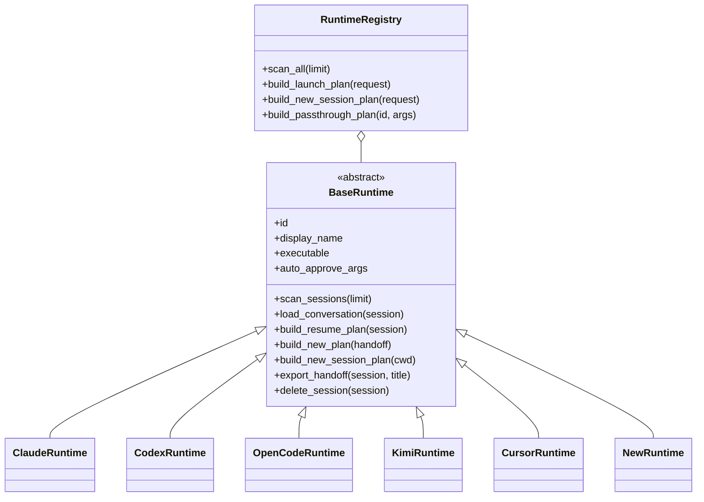
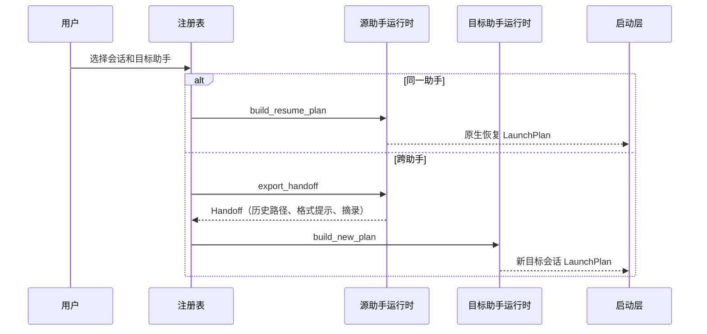

# 新助手接入领域知识库

## §0 目录索引

| § | 标题 | 定位 |
|---|---|---|
| §1 | 业务背景与核心概念 | 首次新增助手运行时前读 |
| §1.5 | 架构概览 | 理解适配器、注册和启动计划的边界 |
| §2 | 核心接入流程 | 从实现到真机验收的完整清单 |
| §2.5 | 物理路径速查 | 直接定位实现与测试 |
| §3 | 代码入口索引 | 按新增、扫描、恢复、接力或展示任务找入口 |
| §4 | 表与外部数据入口 | 确认本域无业务库及历史数据来源 |
| §5 | 流程与组件入口 | 找到注册、扫描缓存、启动编排和展示组件 |
| §6 | 核心规则与隐性约束 | 修改前必扫的 AI 易错点 |
| §7 | 验证路径 | 单测、编译、真实历史和真机验收 |
| §8 | 关联文档 | 按跨域问题联读 |
| §9 | 覆盖度与待补充项 | 了解证据边界 |

## §1 业务背景与核心概念

「新助手接入」是指从零把一种新的 AI 编程助手纳入 pickup：用户能在统一列表看到其本地历史，查看对话预览，原生恢复同一助手的会话，把该会话交给其他助手接力，或在指定工作目录创建空白新会话。

文档主称谓为「新助手」和「助手运行时」。实现中分别对应新的扫描器、`BaseRuntime` 子类（adapter）和注册表中的一项。助手运行时的职责是解释该助手私有的历史格式与命令行语义；统一列表、跨助手编排、保活和内嵌终端不是某个助手运行时的职责。

一条会话在统一层以 `SessionInfo` 表示；跨助手时，源助手运行时将其导出为 `Handoff`，目标助手运行时再生成仅描述启动方式的 `LaunchPlan`。这让第六种及后续助手不需要针对 Claude、Codex、OpenCode、Kimi、Cursor 分别实现转换。

## §1.5 架构概览





## §2 核心接入流程

按以下检查清单完成新助手接入；任何一项缺失都会导致「能扫到但不能使用」或「界面能选到但启动失败」的半接入状态。

1. **确认真实数据与命令能力**：在本机实际创建、续接并结束至少一个新助手会话；记录历史目录或数据库、会话 ID、工作目录、用户/助手正文、时间、原生恢复命令、空白新建命令，以及可安全使用的自动批准参数。不要只依据官网文档推断参数。
2. **实现扫描与预览**：新增 `scan_<助手>.py`，把私有历史转换成完整 `SessionInfo`；列表扫描保持轻量，完整对话在 `load_conversation` 按需读取。过滤内部子任务、空会话、系统注入和标题生成留下的噪音会话。
3. **实现助手运行时**：新增 `runtime/<助手>.py` 的 `BaseRuntime` 子类，声明稳定的 id、显示名、可执行命令、历史阅读提示和唯一一处的 `auto_approve_args`；实现扫描、预览、原生恢复、跨助手目标新建、空白新建。仅在确实支持且已验证时实现带指令的原生续接。
   同时实现 `delete_session(session)`（终端界面 `x` 删除会话用；`BaseRuntime` 默认实现是直接报错，不覆写就等于该助手不支持删除）：删除是彻底抹掉、不可恢复，必须先确认新助手的历史存储形态再决定实现方式——单文件（如 Claude/Codex 的 JSONL）直接 `os.unlink`；每会话一个目录（如 Kimi/Cursor）要整目录 `shutil.rmtree`，只删 `path` 指向的那一个文件会留下同目录的其他元数据文件；**所有会话共享同一份存储时（如 OpenCode 的单个 SQLite 库）绝对不能删文件本身**，必须开一个可写连接、按会话 ID 精确删除对应的行（含外键关联表，按依赖顺序删除、一次事务提交），否则会连带清空其他会话的历史。详见 `docs/SESSION_SCANNING_KNOWLEDGE_BASE.md` 和各 `scan_<助手>.py` 里 `delete_session()` 的实现与测试。
4. **注册一次**：在 `runtime/registry.py` 导入并加入 `default_registry()`。注册表顺序就是默认显示/选择顺序之一；id 必须唯一，且扫描结果的 `source` 必须与其一致。
5. **补展示配色**：仅在 `src/pickup/theme.py` 的 `RUNTIME_LABEL_STYLES` 加一行 `id → 色值`，使列表、详情和预览角色名通过同一个 `runtime_label_style` 自动取得样式。
6. **补测试**：在 `test_runtime.py` 覆盖新助手自身恢复、空白新建、作为跨助手目标、作为跨助手源（有真实可读历史样例时）；补相应扫描器测试，锁定私有格式的过滤和解析。
7. **运行自动验收**：执行编译检查与完整 unittest；运行注册表扫描计时，确保新助手异常不会拖垮其他助手，也不明显拉长首屏。
8. **真机抽查**：随机检查至少 5 条真实新助手历史的扫描与预览；进入终端界面，确认列表显示、配色、同助手恢复、跨助手接力和空白新建。对接力后产生的新目标会话确认原始历史未被改写。

## §2.5 物理路径速查

| 目录或文件（相对 cli 根） | 内容 | 关键类/文件 |
|---|---|---|
| `runtime/base.py` | 助手运行时抽象、统一导出接力信息、工作目录校验 | `BaseRuntime`、`LaunchError` |
| `runtime/registry.py` | 默认注册、并发扫描、同助手恢复与跨助手编排 | `RuntimeRegistry`、`default_registry` |
| `runtime/claude.py` | Claude 对照实现 | `ClaudeRuntime` |
| `runtime/codex.py` | Codex 对照实现 | `CodexRuntime` |
| `runtime/opencode.py` | OpenCode 对照实现；单文件数据库签名优化 | `OpenCodeRuntime` |
| `runtime/kimi.py` | Kimi 对照实现；接力目标的非交互限制 | `KimiRuntime` |
| `runtime/cursor.py` | Cursor 对照实现 | `CursorRuntime` |
| `scan_claude.py` | Claude JSONL 扫描、噪音过滤和预览 | Claude 扫描器 |
| `scan_codex.py` | Codex rollout JSONL 扫描和子助手过滤 | Codex 扫描器 |
| `scan_opencode.py` | OpenCode SQLite 只读扫描 | OpenCode 扫描器 |
| `scan_kimi.py` | Kimi `state.json` / `wire.jsonl` 扫描 | Kimi 扫描器 |
| `scan_cursor.py` | Cursor CLI 目录、JSON 与 SQLite 扫描 | Cursor 扫描器 |
| `models.py` | 统一会话、接力和启动计划数据模型 | `SessionInfo`、`Handoff`、`LaunchPlan` |
| `src/pickup/cli.py` 等 | 启动入口、运行时配色、直启分发 | `RUNTIME_LABEL_STYLES`、`runtime_label_style` |
| `test_runtime.py` | 运行时、注册、接力、缓存和透传参数测试 | `RuntimeTests` |

## §3 本域代码入口索引

| 场景 | 入口 | 类/方法/配置 | 说明 |
|---|---|---|---|
| 定义新助手最小能力 | `runtime/base.py` | `BaseRuntime` | 必须实现扫描、预览、原生恢复、跨助手目标新建、空白新建 |
| 新助手扫描历史 | `scan_<助手>.py` | `scan_sessions(limit)` | 返回按时间倒序的统一会话；单条异常不应使其他助手不可用 |
| 新助手读取完整预览 | `scan_<助手>.py` | `load_conversation(...)` | 只保留真人用户与助手可读文本，按时间正序返回 |
| 同助手恢复 | `runtime/<助手>.py` | `build_resume_plan(session)` | 使用新助手已验证的原生命令和会话 ID |
| 新助手接手其他助手 | `runtime/<助手>.py` | `build_new_plan(handoff)` | 新建目标会话，把统一接力提示词作为首条任务，不伪造恢复 |
| 新助手空白开局 | `runtime/<助手>.py` | `build_new_session_plan(cwd)` | 不带任何历史或接力提示词，只在有效工作目录启动 |
| 新助手作为接力来源 | `runtime/base.py` | `export_handoff(session, title)` | 统一校验历史路径、附带格式提示与摘要；必要时在适配器补充会话定位信息 |
| 彻底删除会话（可选能力） | `runtime/<助手>.py`、`scan_<助手>.py` | `delete_session(session)` | 基类默认报错（不覆写=不支持删除）；单文件直接 unlink，每会话一目录要整目录 `shutil.rmtree`，共享存储（如 OpenCode SQLite）必须开可写连接按会话 ID 精确删行，不能删文件本身 |
| 注册与扫描缓存 | `runtime/registry.py` | `default_registry()`、`scan_all(limit)` | 注册一次；扫描并发且单助手异常隔离 |
| 直启参数透传 | `runtime/registry.py` | `build_passthrough_plan` | 只补 `auto_approve_args`，用户已传入时不重复 |
| 统一会话键与接力正文 | `models.py` | `session_key`、`Handoff.render_prompt` | 标题键按「助手运行时 + 会话 ID」隔离；接力提示词禁止改写源历史 |
| 列表配色 | `src/pickup/cli.py` 等 | `RUNTIME_LABEL_STYLES`、`runtime_label_style` | 颜色唯一来源，界面层不可另建色表 |
| 回归测试 | `test_runtime.py` | `RuntimeTests`、`FakeRuntime` | FakeRuntime 演示无两两转换分支地扩展第六种助手 |

## §4 本域表与外部数据入口索引

本域没有业务数据库表、迁移或服务端持久化模型。pickup 仅读取各助手已存在于本机的历史，不创建、不改写这些历史。

| 外部数据入口 | 典型路径形态 | 用途 | 改动注意 |
|---|---|---|---|
| Claude 历史 | `~/.claude/projects/<项目>/<会话>.jsonl` | JSONL 会话扫描与预览 | 标题生成产生的 `PROMPT_MARKER` 会话必须过滤 |
| Codex 历史 | `~/.codex/sessions/**/rollout-*.jsonl` | JSONL 会话扫描与预览 | 过滤 `thread_source=subagent` 的内部子任务 |
| OpenCode 历史 | `~/.local/share/opencode/opencode.db` 或配置的数据目录 | SQLite 只读扫描与预览 | 处理 WAL；必须只读连接并保留读失败语义 |
| Kimi 历史 | `~/.kimi-code/sessions/<工作区>/<会话>/agents/main/wire.jsonl` | 状态与预览 | 只读主助手流水，忽略旁路子助手 |
| Cursor CLI 历史 | `~/.cursor/chats/<工作区>/<会话>/` | 元数据、提示词和 SQLite 预览 | 只扫 CLI 历史，不扫 IDE 转录目录 |
| 待接入新助手历史 | `<助手私有目录>/<工作区或项目>/<会话文件或数据库>` | 需要在真机先确认 | 先确定读权限、生命周期、子任务标记和写入时机 |

## §5 本域流程与组件入口索引

| 类型 | 标识 | 代码入口 | 适用场景 |
|---|---|---|---|
| 注册组件 | 默认助手注册表 | `runtime/registry.py` 的 `default_registry()` | 让新助手出现在扫描、列表、目标选择和直启分发中 |
| 扫描编排 | 并发扫描 | `RuntimeRegistry.scan_all` | 各助手独立读取历史；单一异常降级，不阻断全局列表 |
| 扫描缓存 | 可选签名 | `BaseRuntime.scan_signature` | 仅可靠的廉价文件级变化信号才能启用 |
| 接力编排 | `Handoff → LaunchPlan` | `RuntimeRegistry.build_launch_plan` | 同助手原生恢复；跨助手新建目标会话 |
| 空白新建编排 | 新会话计划 | `RuntimeRegistry.build_new_session_plan` | 用户选择新助手和工作目录但不关联历史 |
| 直启编排 | 参数透传计划 | `RuntimeRegistry.build_passthrough_plan` | `pickup <助手> [参数…]` 的统一入口 |
| 展示组件 | 运行时标签样式 | `pickup.py` 的 `RUNTIME_LABEL_STYLES` | 列表、详情和预览共享的显示色 |
| 标题噪音防护 | 标记前缀 | `titles.PROMPT_MARKER` 与各扫描器 | 标题生成器可能落盘时，避免自产会话刷入列表 |

## §6 核心业务规则与隐性约束

- **AI 易错点**【禁止】为每两个助手增加转换分支；必须统一走「源助手运行时导出 `Handoff` → 目标助手运行时生成 `LaunchPlan`」。原因是两两组合随助手数量平方增长，且会绕开统一的历史校验、摘要和只读边界。
- **AI 易错点**【禁止】把会话保活、tmux 托管、内嵌抓帧或界面状态塞进新助手适配器；适配器只解释该助手的扫描、预览和启动语义。保活与内嵌是运行时无关层，耦合后新助手会破坏其他助手的生命周期。
- **AI 易错点**【必须】`auto_approve_args` 只能作为助手运行时的单一类属性声明；恢复、空白新建、带指令续接和直启都复用它。若某危险参数只在特定子命令可用，像 OpenCode 一样不放入该属性，并只在已验证的专用路径声明。
- **AI 易错点**【必须】标题缓存和界面状态以「助手运行时 + 会话 ID」为唯一键（`session_key`），不能只用会话 ID。不同助手可能生成相同 ID，纯 ID 会造成标题和状态串台。
- **AI 易错点**【必须】若标题生成调用会写入该助手历史，扫描器必须过滤以 `titles.PROMPT_MARKER` 开头的会话，并在完整解析前尽量廉价预判。否则后台标题任务会变成用户可见的假会话并持续污染列表。
- **AI 易错点**【默认】`scan_signature()` 保持 `None`；只有用真实数据证明文件或 WAL 的元数据变化能完整代表历史与判活变化时才覆写。多层目录的祖先 mtime 不会因既有文件追加而可靠更新，错误签名会让真实会话冻结在旧列表。
- **AI 易错点**【必须】同助手选择原生恢复；跨助手必须创建目标助手的新会话，并只让目标读取源历史。禁止修改、合成或伪造源 JSONL/数据库记录，源历史是权威且必须只读。
- **AI 易错点**【必须】接力摘录的角色标签使用「用户」「助手」，不能使用「你」；「你」会被接手的模型误解为它自身。摘录构建失败应降级为空或扫描摘要，不得阻断接力。
- **AI 易错点**【禁止】在接力提示词注入 `status_tag` 的「已完成」等完成态。是否仍有任务必须由接手助手读取原始历史并检查工作区后决定；完成态会诱导它提前停止。
- **AI 易错点**【必须】新助手配色只在 `RUNTIME_LABEL_STYLES` 新增一行；不要在界面组件重复硬编码颜色。未知 id 已有弱化回退样式。
- **AI 易错点**【必须】扫描器返回完整统一会话字段，并隔离私有历史格式；列表扫描不可因一条损坏记录崩溃。真实历史中的显式 `null`、系统事件、内部子任务和已删除工作目录都应按该助手格式处理。
- 【消歧】「同助手恢复」与「跨助手接力」不是同一能力：前者复用原会话 ID 与原生命令，后者启动全新目标会话并给出源历史位置；不能为了统一命令外观把后者伪装成恢复。
- **AI 易错点**【必须】实现 `delete_session` 前先确认该助手的历史是不是多个会话共享同一份存储（单个数据库/单个索引文件）；共享存储绝不能直接删文件，必须按会话 ID 精确删行，否则会把其他用户会话一起删掉且不可恢复。判断依据是 `SessionInfo.path` 的真实含义——同一助手的多条会话若 `path` 指向同一个文件（如 OpenCode 的 `opencode.db`），就是共享存储。

## §7 验证路径

1. **静态与全量单测**：在 cli 根执行：

   ```bash
   python3 -m compileall -q src/pickup tests
   python3 -m unittest -v
   ```

2. **运行时单测补齐**：在 `test_runtime.py` 仿照 `FakeRuntime` 与现有 Claude/Codex/OpenCode/Kimi/Cursor 用例，断言：
   - 新助手已包含在默认注册表，id、可执行命令和显示名正确；
   - 同助手恢复计划保留该助手独有参数；
   - 空白新建没有接力提示词，且只在有效工作目录启动；
   - Claude 或其他现有助手能交给新助手接力，新助手也能作为源交给一个现有助手；
   - `build_passthrough_plan` 仅补一次自动批准参数；
   - 新助手扫描异常不影响其他助手扫描结果。

3. **扫描器格式测试**：为新助手的最小真实格式夹具覆盖首条/末条用户消息、助手正文、时间、工作目录、原生会话 ID、空会话、系统事件、子任务和 JSON `null`（若格式允许）。当标题生成可能落盘时，断言 `PROMPT_MARKER` 会话不进入列表。

4. **扫描耗时与缓存语义**：执行：

   ```bash
   python3 -c "import time; from runtime import default_registry; r=default_registry(); t=time.perf_counter(); r.scan_all(50); print(f'{(time.perf_counter()-t)*1000:.0f}ms')"
   ```

   记录实测值；若实现了 `scan_signature`，额外修改真实历史、启动/退出对应助手进程，确认两种变化都会触发重扫，而签名不变时才复用缓存。

5. **真实历史抽查**：随机抽查至少 5 条本机新助手会话，分别调用扫描与预览，检查无空文本、字面量 `"None"`、错误角色、时间倒序、内部子任务或标题生成噪音；同时确认扫描出的历史路径实际存在。

6. **真机流程验收**：用当前源码启动 `python3 -m pickup --limit 5`，确认新助手出现在列表和高级操作目标中、标签颜色可区分。分别完成同助手恢复、从一个现有助手交给新助手、从新助手交给一个现有助手、指定工作目录的空白新建；跨助手后检查源历史文件的修改时间和内容未被本流程改写。

7. **对照验收**：将新助手逐项与现有适配器对照，而非只验证「能启动」：
   - Claude/Codex：多层 JSONL 历史，默认不使用扫描签名；
   - OpenCode：单 SQLite + WAL，签名可用但自动批准参数受子命令限制；
   - Kimi：工作区/会话目录与协议事件流，接力到目标时可能只能非交互运行；
   - Cursor：CLI 历史目录与按需 SQLite 预览，恢复命令为 `agent --resume`。

8. **删除能力验证（若实现了 `delete_session`）**：删除不可恢复，一律用临时构造的假会话验证，不要碰真实历史。至少覆盖：调用后该会话确实从磁盘消失（文件被删/目录被整体删除/数据库对应行被删）；共享存储的助手额外断言删除后**其他会话仍能正常扫描且内容未变**（防止误删连带其他会话）；未实现 `delete_session` 时终端界面按 `x` 应提示「尚未支持删除会话」而不是崩溃。

## §8 关联文档

- [SESSION_SCANNING_KNOWLEDGE_BASE.md](SESSION_SCANNING_KNOWLEDGE_BASE.md)：改扫描目录、会话统一字段、预览解析、时间排序、性能或噪音过滤时联读。
- [CROSS_RUNTIME_HANDOFF_KNOWLEDGE_BASE.md](CROSS_RUNTIME_HANDOFF_KNOWLEDGE_BASE.md)：改同助手恢复、跨助手接力提示词、历史只读边界或启动计划时联读。
- [TERMINAL_UI_KNOWLEDGE_BASE.md](TERMINAL_UI_KNOWLEDGE_BASE.md)：改列表可见性、高级操作入口、运行时名称展示或用户可见操作时联读。
- [MAINTAINER_GUIDE.md](MAINTAINER_GUIDE.md)：改运行时边界、扫描器细节、标题噪音、配色、直启或真实路径验证时联读。

## §9 覆盖度与待补充项

- 代码推断覆盖：已覆盖五个现有助手的运行时抽象、注册、扫描入口、统一会话模型、接力编排、自动批准参数、标题过滤、配色和测试模式。
- 领域语言统一：正文统一使用「新助手」「助手运行时」；首次出现时保留 runtime、`BaseRuntime`、adapter 等实现别名，避免把产品概念误当成某个目录或类名。
- 多源证据补强：已读取抽象层、注册层、五个现有适配器、五个扫描器、统一模型、运行时测试、维护指南与界面配色入口。
- 用户 / 资料补充：当前缺少待接入助手的真实历史样本、命令行版本与权限参数证据；接入时必须由真机数据补齐。
- Q&A 补充：本次根据既有架构约束沉淀 12 条核心规则，其中 10 条标为 AI 易错点；提供 7 条可执行验证路径。
- 待补充：未来新增助手的历史保留策略、历史目录是否可配置、会话删除/归档语义、子助手标识、原生恢复与预置首条提示词能力，均需逐个助手实测，不可从现有五种助手外推。

<!-- 该文档由 doc-init 生成于 2026-07-19；定位：AI 修改新助手接入域前的快速参考文档 -->
