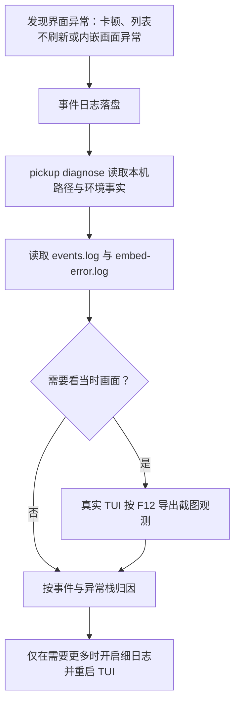

# 可观测与诊断领域知识库

pickup 是本地终端应用，诊断信息只留在本机，不发送远程遥测。本文统一使用“事件日志”“诊断”“截图观测（F12）”“界面异常排查”四个主称谓，覆盖 TUI 占用终端时的排障闭环。

## §0 目录索引

| § | 标题 | 何时阅读 |
|---|---|---|
| §1 | 业务背景与核心概念 | 首次处理界面异常排查时 |
| §2 | 诊断闭环 | 卡顿、刷新异常、内嵌画面异常时 |
| §3 | 代码入口索引 | 改事件日志、诊断或截图观测时 |
| §4 | 本地数据与路径 | 查日志、截图和隐私边界时 |
| §5 | 运行组件与事件 | 增加或核对观测点时 |
| §6 | 核心业务规则与隐性约束 | 改代码前必扫的 AI 易错点 |
| §7 | 验证路径 | 完成变更后验证时 |
| §8 | 关联文档 | 进入相邻领域前 |
| §9 | 覆盖度与待补充项 | 判断本文边界时 |

## §1 业务背景与核心概念

终端界面运行后会占用终端，标准错误输出通常不可见；因此，界面异常排查不能依赖临时打印，而要通过本地事件日志、只读诊断和用户主动导出的截图观测建立证据。

| 主称谓 | 含义 | 边界 |
|---|---|---|
| 事件日志 | 一行一条 JSON 的本地结构化事件 | 不记录对话正文，不是远程遥测 |
| 诊断 | `pickup diagnose` 输出本机诊断事实 | 只读，不启动 TUI、不写入或接管会话 |
| 截图观测（F12） | 用户在真实 TUI 中导出的当前 SVG 画面 | 可能含真实对话，仅供本地排查 |
| 界面异常排查 | 将事件、异常栈与截图关联定位问题的只读流程 | 不借此修改业务功能或启动会话 |
| 细日志 | 仅在调试开关开启后追加的 debug 级事件 | 默认关闭，不能把详细内容变成常规日志 |

## §2 诊断闭环

异常发生后按以下顺序取证；顺序的目标是先获得不打扰现场的客观事实，再补充画面证据。

1. 先执行 `pickup diagnose`，确认事件日志、异常日志、截图目录、tmux 版本和配色自检等本机事实。
2. 读取事件日志，按时间、事件名、耗时和脱敏后的上下文判断扫描、列表重建、托管或抓帧是否异常。
3. 若出现 `error` 事件，再读取异常日志取得完整 traceback；事件日志本身只保留异常地点、类型和短消息。
4. 需要确认用户实际看见的布局或画面时，让用户在真实 TUI 内按 F12，再结合同一时间段的日志排查。
5. 默认信息不足时，设置 `PICKUP_DEBUG=1` 或 `PICKUP_LOG=debug` 后重启 TUI，复现一次并读取新增的 debug 事件。

## §3 代码入口索引

| 场景 | 入口 | 作用 |
|---|---|---|
| 事件日志、脱敏、截断与写失败降级 | `observe.py` | 统一实现事件、细日志、计时、异常记录与截图导出 |
| 一键只读诊断 | `agent_api.py` 的 `cmd_diagnose` | 返回缓存、日志、截图、tmux 与配色自检事实 |
| F12 绑定与用户提示 | `ui/main_screen.py` 的 `MainScreen.action_save_screenshot` | 调用截图观测并在成功后提示保存位置 |
| 抓帧/重扫错误桥接 | `pickup.py` 的 `_log_embed_error` | 将后台异常同时写成事件与 traceback 文件 |
| 后台会话重扫观测 | `pickup.py` 的 `SessionStore.load` / `refresh` 与 `ui/main_screen.py` 的刷新 worker | 记录 `scan_all`，异常后保留后台循环 |
| 内嵌会话托管观测 | `ui/main_screen.py` 的 `_host_and_focus` / `_host_direct_worker` | 记录 `host_session` 的耗时、运行时和成功状态 |
| 抓帧异常与慢帧观测 | `ui/embed_pane.py`、`embed.py` | 记录 `capture_slow`，异常写入异常日志并继续抓帧 |
| 回归约束 | `test_observe.py` | 覆盖 JSON 行、细日志开关、脱敏、256KB 截断、计时和异常双写 |

## §4 本地数据与路径

本域没有业务表、没有远程指标库，也不写入各运行时的会话历史。路径均相对当前操作系统用户主目录：

| 本地位置 | 内容 | 读取/写入边界 |
|---|---|---|
| `~/.cache/pickup/events.log` | 结构化事件日志，一行一个 JSON | 本地追加；每次写前超过 256KB 则截断 |
| `~/.cache/pickup/embed-error.log` | 后台异常的完整 traceback | 本地追加；每次写前超过 256KB 则截断 |
| `~/.cache/pickup/screenshots/tui-*.svg` | F12 导出的真实 TUI 截图 | 仅用户主动触发；可能包含真实对话 |
| `~/.cache/pickup/` | 诊断、截图和其它本地缓存根目录 | `pickup diagnose` 只报告路径与存在性 |
| `docs/screenshots/list.png` | 文档/验收截图产物 | 仅由虚构演示数据生成，不代表真实现场 |

日志和截图均属于本地敏感材料：不得提交真实会话内容、缓存、日志、token、API 密钥或截图到仓库。

## §5 运行组件与事件

| 组件/事件 | 何时产生 | 默认记录内容 |
|---|---|---|
| `scan_all` | 会话初始加载或后台重扫完成 | `duration_ms`、会话数量等低基数事实 |
| `list_rebuild` | 界面会话列表重建结束 | 耗时与重建模式 |
| `host_session` | 内嵌会话托管成功或失败 | 耗时、运行时、`ok` |
| `capture_slow` | 单次抓帧达到或超过 100ms | 耗时与低基数状态 |
| `screenshot` | 用户按 F12 成功导出截图 | 本地路径和 SVG 格式 |
| `error` | 抓帧、重扫、截图等后台路径出现异常 | 位置、异常类型、短消息；完整栈另存 |
| debug 事件 | 已开启细日志时 | 仅用于补充诊断上下文，不应承载正文 |

`timed` 在操作结束时补充 `duration_ms`，使“发生了什么”和“是否变慢”可在同一事件日志中关联。事件日志默认只记录低基数名称和状态；会话文本、提示词、命令参数、令牌等不应作为诊断字段。

## §6 核心业务规则与隐性约束

1. **TUI 下必须落盘。** TUI 占用终端后 stderr 不可靠或不可见，诊断证据必须写入本地文件，不能只靠控制台打印。
2. **写日志失败必须吞掉。** 创建目录、截断或写文件失败都不能拖死抓帧、后台重扫或界面线程；观测是降级能力，不得成为主流程可用性的前置条件。
3. **默认只写低基数事件。** 常规日志仅保留事件名、耗时、状态、运行时等可聚合事实；细粒度上下文只在 `PICKUP_DEBUG=1` 或 `PICKUP_LOG=debug` 时写入。
4. **敏感内容必须脱敏。** 字段名为 `text`、`prompt`、`messages`、`message`、`content`、`body`、`argv`、`command`、`token`、`api_key`、`password`、`secret`（含大小写变化）时，一律以 `<redacted>` 落盘；不要新增近义字段来绕过该规则。
5. **日志上限为 256KB。** `events.log` 与 `embed-error.log` 在下一次写入前若超过 256KB 即截断，防止长期运行无限占用本地磁盘；这是截断，不是保留历史轮转。
6. **异常需要双层证据。** 事件日志写无 traceback 的 `error`，异常日志写完整 traceback；不要把完整栈或会话内容塞回结构化事件。
7. **诊断必须只读。** `pickup diagnose` 只检查本地路径、文件是否存在、tmux 版本和配色自检；不得启动 TUI、创建会话、写入历史、消费模型额度或改变会话状态。
8. **F12 与验收截图不能混用。** F12 是真实用户现场截图，可能含隐私；`docs/screenshots/capture.py` 用虚构夹具生成仓库验收图。不能用后者替代现场取证，也不能把前者提交到仓库。
9. **SVG 不能证明真彩色。** F12/Textual 的 SVG 导出可能把真彩色压成灰阶；排查 runtime 配色需以真实终端或界面样式验证为准。
10. **界面异常后后台循环应继续。** 抓帧或重扫发生未预料异常时记录错误后继续下一轮，不能因为观测或单次失败让后台线程静默死亡。

## §7 验证路径

| 验证目标 | 操作 | 通过标准 |
|---|---|---|
| 事件日志基础契约 | `python3 -m unittest -v test_observe.py` | JSON 行包含时间、级别和事件名 |
| 细日志开关 | 在测试或本机分别关闭/开启 `PICKUP_DEBUG=1`、`PICKUP_LOG=debug` | 默认不写 debug，开启后才出现 debug 事件 |
| 脱敏与容量边界 | `python3 -m unittest -v test_observe.py` | 敏感字段变为 `<redacted>`，超过 256KB 后可继续写入 |
| 异常双写 | `python3 -m unittest -v test_observe.py` | `error` 事件无 traceback，异常日志有完整 traceback |
| 只读诊断 | `python3 -m pickup diagnose` 或已安装命令 `pickup diagnose` | 返回日志/截图目录、存在性、tmux 与配色事实；不启动 TUI |
| 事件现场读取 | `python3 -m pickup diagnose` 后读取 `~/.cache/pickup/events.log` | 能按 JSON 行查看 `scan_all`、`list_rebuild`、`host_session`、`capture_slow`、`error` 等 |
| 截图观测 | 在真实 TUI 中按 F12 | 生成 `~/.cache/pickup/screenshots/tui-*.svg`，并只作本地排查使用 |
| 验收截图消歧 | `python3 docs/screenshots/capture.py` | 生成虚构数据的验收图；不读取真实历史，不替代 F12 现场截图 |

## §8 关联文档

| 文档 | 联读场景 |
|---|---|
| `docs/TERMINAL_UI_KNOWLEDGE_BASE.md` | 排查终端界面刷新、快捷键、列表或右栏展示异常时 |
| `docs/EMBEDDED_TERMINAL_KNOWLEDGE_BASE.md` | 排查内嵌实时终端、抓帧、控制通道或托管画面问题时；抓帧协议细节以该文档为准 |
| `docs/SKILL.md` | 面向 Agent 执行“界面异常排查”只读流程、解释 `pickup diagnose` 时 |
| `PRIVACY.md` | 判断日志、截图、会话历史和本地缓存的隐私边界与提交限制时 |
| `docs/MAINTAINER_GUIDE.md` | 修改或评审可观测性实现、事件名、性能观测和 F12 行为时 |

## §9 覆盖度与待补充项

本文根据事件日志实现、诊断子命令、F12 入口、观测测试、维护指南、Agent 使用文档和隐私说明编写，覆盖本地诊断闭环与隐私边界。

刻意不覆盖：

- 业务功能本身的修复策略；
- 内嵌实时终端的抓帧协议和控制通道实现细节，参见内嵌实时终端知识库；
- 发布、远程遥测、Prometheus 或任何远端收集方案；
- 未在当前实现中定义的日志保留天数、上传、检索或告警机制。
