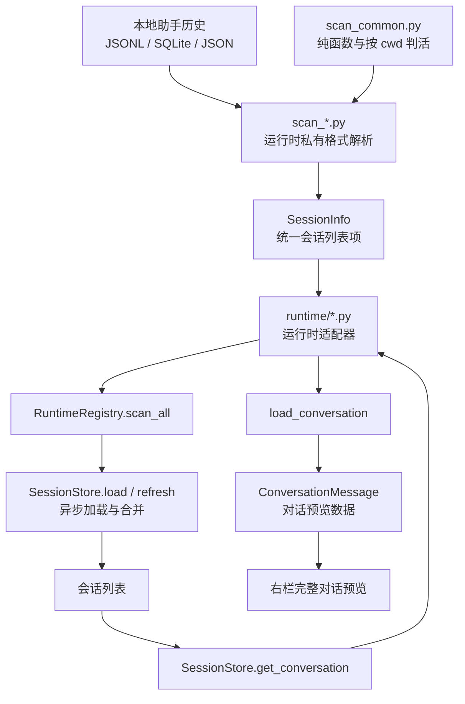
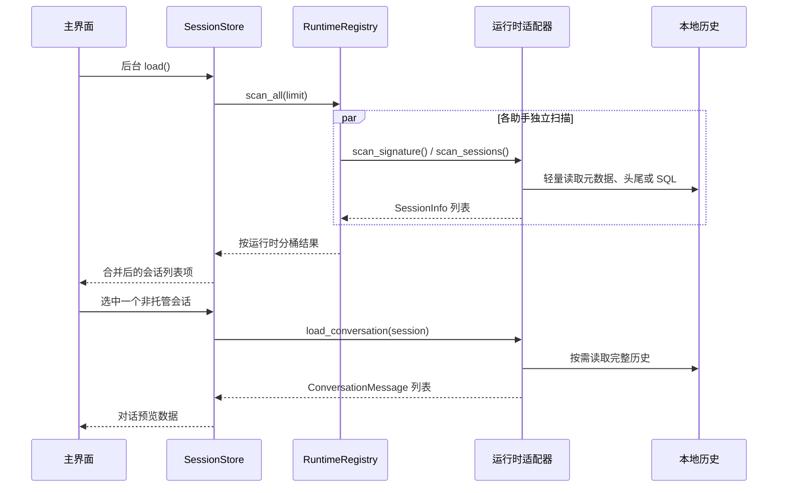
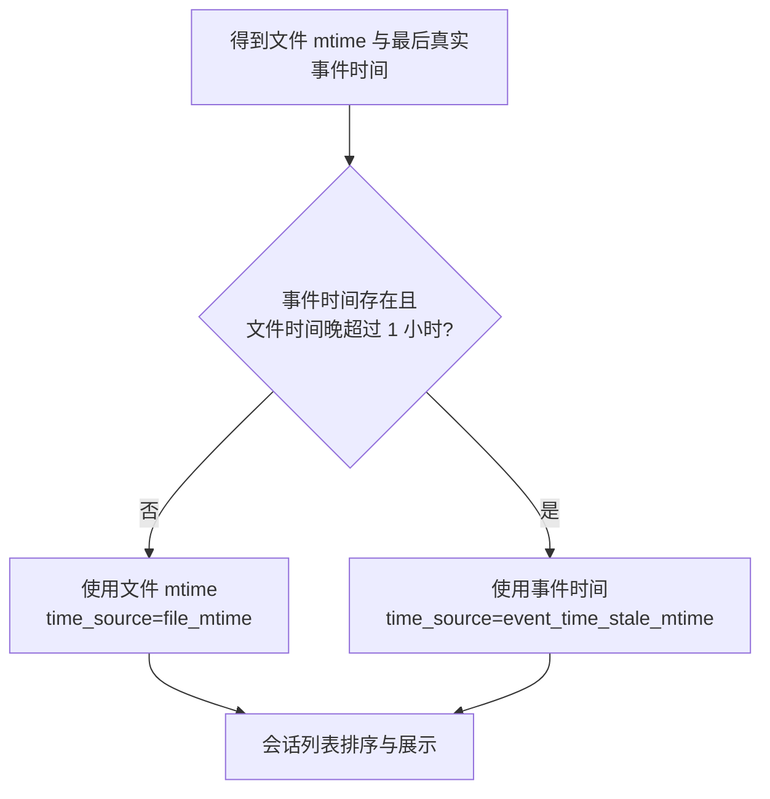

# 会话扫描与对话内容领域知识库

## §0 目录索引

| § | 标题 | 定位 |
|---|------|------|
| §1 | 业务背景与核心概念 | 首次接触会话扫描时读 |
| §1.5 | 架构概览 | 理解本地历史到预览的分层与调用关系 |
| §2 | 核心业务流程 | 修改扫描、排序、缓存或预览前读 |
| §2.5 | 物理路径速查 | 直接定位扫描与适配实现 |
| §3 | 代码入口索引 | 按任务场景找正确入口 |
| §4 | 外部数据入口索引 | 排查本地历史格式、路径和存储形态时读 |
| §5 | 流程、组件与缓存入口索引 | 改并发扫描、判活、缓存时读 |
| §6 | 核心业务规则与隐性约束 | 改代码前必扫的 AI 易错点 |
| §7 | 验证路径 | 改完扫描或预览后执行 |
| §8 | 关联文档 | 跨域改动时联读 |
| §9 | 覆盖度与待补充项 | 了解证据范围与缺口 |

## §1 业务背景与核心概念

pickup 的会话扫描负责从本机已安装助手的私有历史中读取可恢复会话，转换成统一的**会话列表项**（`SessionInfo`），供主界面、只读查询和接力编排复用。扫描是只读的：不修改历史、不启动助手，也不把历史同步到业务数据库或远程服务。

本域服务两个用户可见目标：

1. 主界面能尽快显示跨助手、按最近活动排序的会话列表，并给出工作目录、标题、时间和“运行中”状态。
2. 用户选中已结束或未托管会话时，按需读取完整历史，将其转换为**完整对话**（`ConversationMessage`）供右栏预览；列表扫描本身不能为了预览而全量读大文件。

核心概念统一如下：

| 主称谓 | 实现名称/来源 | 业务含义 |
|---|---|---|
| 会话扫描 | `scan_sessions()` | 从某一助手本地历史产生会话列表项的轻量读取过程 |
| 会话列表项 | `SessionInfo` | 统一的跨助手会话元数据：标识、目录、时间、标题、摘要、状态、判活结果和历史入口 |
| 对话预览数据 | `ConversationMessage` 列表 | 从原始历史按时间顺序提取的真人用户消息与助手文本，供右栏展示 |
| 完整对话 | `ConversationMessage` | 对话预览数据中的单条消息；角色只能是 `user` 或 `assistant` |
| 有效会话时间 | `mtime` / `time_source` | 列表排序和展示使用的时间；通常是文件更新时间，疑似被元数据污染时回退真实事件时间 |
| 原生标题 | `native_title` | 助手历史已有的标题；可为空，不能替代完整标题补全策略 |
| 兜底标题 | `fallback_title` | 扫描期从首尾真实对话提取的无需模型调用的标题 |
| 运行中 | `live` / `pid` | 进程活性探测的结果，用于判断会话是否仍有本地进程 |

本域边界：

- 包含：五种助手的历史格式解析、统一会话列表项、轻量排序与过滤、判活、完整对话按需加载、扫描签名跳过、预览缓存失效。
- 不包含：终端界面布局与交互、托管会话实时画面、标题生成算法、跨助手接力提示词的渲染规则、机器接口 JSON 契约全文。
- 接力只消费本域导出的历史入口和对话预览数据；接力如何生成或执行目标命令属于“跨助手接力与启动”域。

## §1.5 架构概览





## §2 核心业务流程

### 2.1 首次扫描与统一列表

1. `SessionStore.load()` 在后台运行；主界面先展示骨架，不能因为扫描尚未完成而误报“没有会话”。
2. `RuntimeRegistry.scan_all(limit)` 为各助手并发启动独立扫描，重叠磁盘 I/O；单一运行时解析失败被隔离，不得拖垮其余助手。
3. 每个适配器调用自身 `scan_sessions(limit)`，只读取形成会话列表项所需的轻量数据：
   - Claude、Codex：候选 JSONL 文件按真实文件 mtime 排序，只解析到足够有效项为止。
   - Kimi：按主 `wire.jsonl` 的 mtime 排序，读取 `state.json` 与主 agent 事件流的头尾。
   - OpenCode：一次只读 SQL 获取顶层、未归档会话与摘要。
   - Cursor：只读 `meta.json` 和 `prompt_history.json`；不在列表阶段打开 `store.db`。
4. 各扫描器返回字段完整的会话列表项，按有效会话时间降序排列。`SessionStore._merge_scanned()` 合并所有来源；已在列表出现过的会话位置稳定，新出现会话才按时间插入顶部。
5. `keepalive.annotate()` 可在合并后补充托管标记；这不改变扫描器只读本地历史和进程状态的边界。

### 2.2 运行中判定

“运行中”是会话关联进程是否存活的二值事实，而不是会话对话状态。

| 助手 | 判活来源 | 归属规则 | 降级行为 |
|---|---|---|---|
| Claude | `~/.claude/sessions/<pid>.json` + `os.kill(pid, 0)` | 文件中的 `sessionId` 映射到 pid | 注册文件损坏或进程不存在则视为已结束 |
| Codex | 活着的 `codex` 进程持有的 `rollout-*.jsonl` | 从打开的文件名提取会话 UUID | Linux 读 `/proc/<pid>/fd`；macOS 合并一次 `lsof` |
| OpenCode | 同名进程的当前工作目录 | 同 cwd 仅最新会话标为运行中 | 无法探测时返回空映射 |
| Kimi | `kimi-code` 进程的当前工作目录 | 同 cwd 仅最新会话标为运行中 | 无法探测时返回空映射 |
| Cursor | `agent` 进程；优先解析命令行 `--resume <chatId>`，其次读打开的 `store.db` 路径，再次读 `PICKUP_SESSION_ID`/`SC_SESSION_ID` | 只按上述正向证据精确绑定；禁止再按「cwd → 最新会话」猜测。空白新建的临时 8 位标识不参与匹配 | 无法探测时返回空列表 |

### 2.3 完整对话按需加载

1. 用户选中会话后，`SessionStore.get_conversation()` 以“运行时 + 会话 ID”定位预览缓存。
2. 先检查进程内缓存，再按历史入口的设备、inode、字节数和纳秒修改时间检查本地派生缓存；签名未变化则复用已有对话预览数据。
3. 签名变化或无缓存时，定位对应运行时适配器的 `load_conversation(session)`。
4. 适配器委托相应 `scan_*.load_conversation` 读取完整对话；原始系统事件、思考分片、工具定义和空文本不进入完整对话。
5. 返回的消息按时间顺序同时写入进程内缓存和有界本地派生缓存，再交给右栏。解析失败返回空列表，不得因一个损坏历史文件导致主界面崩溃。

### 2.4 会话时间与排序

`effective_session_time(file_mtime, event_time)` 统一处理“文件看似刚更新、真实对话却很久以前”的情况：



这避免 Claude/Codex 驻留、同步、复制或元数据刷新只 touch 文件而让旧会话误排到顶部。OpenCode 使用数据库的 `time_updated`，其 `time_source` 为 `db_time_updated`。

### 2.5 扫描签名跳过

后台刷新会反复调用 `scan_all()`。只有可靠的廉价签名才允许跳过完整扫描：

1. OpenCode 的签名包含数据库及可选 `-wal` 文件的 mtime，以及排序后的“工作目录 → pid”活性快照。
2. 签名不变时复用上一份成功扫描结果，但必须复制每个会话列表项，禁止让界面就地添加的展示字段污染缓存。
3. OpenCode 读取失败时保留上一份成功结果，不能用空列表覆盖。
4. Claude/Codex 不使用父目录签名：多层目录下文件追加不会可靠更新父目录 mtime。两者逐文件使用精确签名复用已解析元数据；Codex 还把会话名称索引签名纳入版本。
5. Kimi 按主事件流文件精确签名复用元数据；Cursor 按元数据文件签名，并额外绑定提示历史与正文数据库签名。缓存写意图在全部运行时扫描完成后一次事务提交，避免逐条同步写盘。
6. 这些缓存是可删除的本地派生数据；损坏、锁竞争或禁用时必须按未命中处理，不能改变扫描结果。完整边界见 `PERFORMANCE_KNOWLEDGE_BASE.md`。

## §2.5 物理路径速查

| 目录（相对 cli） | 内容 | 关键文件 |
|---|---|---|
| `./` | Claude 历史扫描、预览解析、轻量过滤 | `scan_claude.py` |
| `./` | Codex 历史扫描、判活、预览解析 | `scan_codex.py` |
| `./` | OpenCode SQLite 扫描、签名与预览解析 | `scan_opencode.py` |
| `./` | Kimi 元数据与主事件流扫描、预览解析 | `scan_kimi.py` |
| `./` | Cursor CLI 元数据扫描、SQLite blob 预览 | `scan_cursor.py` |
| `./` | 跨扫描器纯函数、按 cwd 判活 | `scan_common.py` |
| `runtime/` | 统一适配抽象、注册表与各助手委托 | `runtime/base.py`、`runtime/registry.py`、`runtime/*.py` |
| `./` | 会话列表合并、异步加载、预览缓存 | `src/pickup/cli.py` 等 |
| `./` | 统一会话与完整对话的数据结构 | `models.py` |
| `./` | 扫描、格式、缓存与性能回归测试 | `test_session_scanning.py` |

## §3 本域代码入口索引

| 场景 | 入口 | 类/方法/配置 | 说明 |
|---|---|---|---|
| 新增或修改统一列表字段 | 统一数据模型 | `models.py` 的 `SessionInfo` | 五个扫描器都必须填充统一语义，跨运行时唯一键是“运行时 + 会话 ID” |
| 新增或修改预览消息规则 | 统一数据模型 | `models.py` 的 `ConversationMessage` | 只允许 `user` 与 `assistant` 两种角色；时间戳可为空 |
| 修改 Claude 扫描或列表轻量化 | Claude 扫描器 | `scan_claude.scan_sessions()`、`_peek_head_meta()`、`_build_session_info()` | 先 mtime 排序，预探过滤噪音和失效 cwd，再头尾解析 |
| 修改 Claude 完整预览 | Claude 扫描器 | `scan_claude.load_conversation()` | 只根据文本内容决定是否展示 assistant 消息；保留真人用户消息 |
| 修改 Codex 扫描或判活 | Codex 扫描器 | `scan_codex.scan_sessions()`、`_live_session_ids()` | 过滤子代理线程；macOS 使用批量 `lsof`，不可逐 pid 调用 |
| 修改 Codex 完整预览 | Codex 扫描器 | `scan_codex.load_conversation()` | 读取 `event_msg` 的用户、过程叙述和最终答复文本 |
| 修改 OpenCode 查询或刷新跳过 | OpenCode 扫描器 | `scan_opencode.scan_sessions()`、`scan_signature()` | 历史为 SQLite；签名需同时覆盖 DB/WAL 和进程活性快照 |
| 修改 OpenCode 完整预览 | OpenCode 扫描器 | `scan_opencode.load_conversation()` | 从 `message` 与 `part` 表合并同一消息的多个 text part |
| 修改 Kimi 事件过滤或预览 | Kimi 扫描器 | `scan_kimi._iter_message_entries()`、`load_conversation()` | 只读 `agents/main/wire.jsonl`，跳过 think、工具快照和子 agent |
| 修改 Cursor 扫描或预览 | Cursor 扫描器 | `scan_cursor.scan_sessions()`、`_apply_live_flags()`、`load_conversation()` | 列表不读 `store.db`；预览才读 blob；同 cwd 多 `agent` 必须按 resume / 打开的 store.db / 完整 PICKUP_SESSION_ID 精确绑定，禁止 cwd 猜测 |
| 修改共用路径、时间、cwd 判活 | 共享 helper | `scan_common.shorten_cwd()`、`parse_timestamp()`、`live_processes()`、`live_pids_by_process_name()`、`process_command_line()` | 只放无状态纯函数；需要全部同名进程时用 `live_processes`，不要先按 cwd 折叠 |
| 修改跨运行时并发或扫描复用 | 注册表 | `runtime.registry.RuntimeRegistry.scan_all()` | 各运行时并发、异常隔离、结果副本隔离、签名命中跳过 |
| 修改异步首屏、列表合并或预览缓存 | 会话存储 | `pickup.SessionStore.load()`、`refresh()`、`get_conversation()` | `store.load` 在后台线程，预览缓存按 mtime 失效 |
| 修改运行时委托边界 | 运行时适配 | `runtime.base.BaseRuntime` 与 `runtime/*.py` | 适配器只把统一调用委托给私有扫描器，不在界面层写运行时分支 |
| 修改任一助手的彻底删除逻辑 | 各扫描器 | `scan_<助手>.delete_session(...)` | Claude/Codex 单文件 `os.unlink`；Kimi/Cursor 每会话一目录、`shutil.rmtree` 整个会话目录；OpenCode 所有会话共享一个库，必须按会话 ID 在可写连接里精确删 `part`/`message`/`session` 三表对应行，一次事务提交，不能删文件本身（见 §4 与 `docs/TERMINAL_UI_KNOWLEDGE_BASE.md` 的 `x` 删除会话流程） |

## §4 本域外部数据入口索引

本域没有业务数据库、没有项目业务表，也不维护权威会话镜像。所有输入都是各助手自己的本机历史；读取必须只读，文件路径可随助手版本变化而演进。pickup 仅维护可随时删除和重建的本地派生缓存，不改变任何助手的历史。

| 助手 | 默认本地入口（相对用户主目录） | 文件形态 | 列表读取 | 完整对话读取 | 改动注意 |
|---|---|---|---|---|---|
| Claude Code | `~/.claude/projects/<project>/<session>.jsonl` | JSONL | 头部最多 300 行 + 尾部 64KB | 整个 JSONL | 另用 `~/.claude/sessions/<pid>.json` 判活；系统注入可能伪装成 user |
| Codex | `~/.codex/sessions/**/rollout-*.jsonl` | JSONL | 头部最多 30 行 + 尾部 8KB | 整个 JSONL | 可读取 `~/.codex/session_index.jsonl` 取原生标题；子代理 rollout 必须过滤 |
| OpenCode | `~/.local/share/opencode/opencode.db` | SQLite，可能 WAL | `session`、`message`、`part` 三表的只读 SQL | 同三表、按消息与分片合并 | `OPENCODE_DATA_DIR` 或 `XDG_DATA_HOME` 可改入口；只读打开失败不能伪装为空历史；删除会话是唯一写入例外，见下方「外部数据读取原则」 |
| Kimi Code | `~/.kimi-code/sessions/<workspace>/<session>/` | `state.json` + `agents/main/wire.jsonl` | state + wire 头尾 | 主 `wire.jsonl` | 忽略 `agents/<other>/wire.jsonl`；事件流含大系统行 |
| Cursor Agent CLI | `~/.cursor/chats/<workspace>/<chatId>/` | `meta.json`、`prompt_history.json`、`store.db` | meta + prompt history | SQLite `blobs` JSON blob | 只扫 CLI 历史，不扫 IDE 的 agent transcripts；二进制 DAG blob 跳过 |

外部数据读取原则：

- 历史路径不存在时该运行时返回空列表；这是“未安装/未使用”的正常状态。
- 历史格式损坏、单行 JSON 损坏或单个数据库查询失败，应在该条或该数据源边界降级，不能导致其他助手不可用。
- **扫描与预览** 一律只读：SQLite 用只读 URI 打开，不得为了读取会话而创建、迁移、checkpoint 或写回数据库。
- **删除是唯一的写入例外**：终端界面 `x` 删除会话（不可恢复）需要真正修改磁盘，各 `delete_session()` 因此允许写操作——OpenCode 是全仓第一处、也是唯一一处可写 SQLite 连接（`scan_opencode.delete_session()`，非只读 URI），仅用于按会话 ID 删除该会话自己的行，不得用于任何读取路径。
- 历史中的绝对路径、用户文本和工具输出是隐私数据；不得写入仓库、截图夹具、遥测或诊断默认日志。

## §5 本域流程、组件与缓存入口索引

| 类型 | 标识 | 代码入口 | 适用场景 |
|---|---|---|---|
| 扫描流程 | 并发全量入口 | `RuntimeRegistry.scan_all()` | 首次加载、后台刷新和性能优化 |
| 扫描缓存 | 运行时签名缓存 | `RuntimeRegistry._scan_cache`、`_scan_cache_result` | 仅可靠签名的运行时跳过完整扫描 |
| 预览缓存 | 会话键 → `(mtime, 消息列表)` | `SessionStore.conversations` | 右栏重复预览、轮询刷新 |
| 合并流程 | 稳定会话顺序 | `SessionStore._merge_scanned()` | 让已展示项目不因内容更新跳动 |
| 异步任务 | 首屏后台加载 | `SessionStore.load()` / `wait_loaded()` | TUI 首帧不能被磁盘扫描阻塞 |
| 时间修正 | 有效会话时间 | `models.effective_session_time()` | 文件 mtime 与真实事件时间脱节时 |
| 共享组件 | 路径/时间/按 cwd 判活 | `scan_common.py` | 多扫描器一致的展示和活性兜底 |
| 进程活性 | Claude 专用 pid 注册 | `scan_claude._live_session_ids()` | 会话与 Claude pid 的精确关联 |
| 进程活性 | Codex 打开文件关联 | `scan_codex._live_session_ids()` | 会话与 rollout 文件描述符关联 |
| 进程活性 | 全部同名进程列表 / cwd→单 pid 折叠 | `scan_common.live_processes()`、`live_pids_by_process_name()` | Cursor 用前者做精确绑定；OpenCode/Kimi 仍用后者保守标最新一条 |

## §6 核心业务规则与隐性约束

- **AI 易错点**【禁止】用 Claude 的 `stop_reason` 判断 assistant 文本是否应展示 → 必须只要存在非空 text 分片就保留（原因：thinking、文本与工具调用是独立顶层记录，却可能共享 `tool_use` 的 stop reason）。
- **AI 易错点**【禁止】把原始 `type: "user"` 一律视为真人输入 → 必须检查 `origin.kind`；Claude 只接受缺失或 `human`，Kimi 只接受缺失或 `user`（原因：Monitor、task-notification 等系统注入会伪装在用户轮次中）。
- **AI 易错点**【禁止】让完整对话出现 system、think、工具定义、工具结果或空文本 → 对话预览只保留真实用户消息和助手最终可读答复（原因：右栏是用户对话预览，不是原始事件调试器）。
- **AI 易错点**【禁止】以 `dict.get(key, 默认值)` 单独防范历史字段缺失 → 嵌套 JSON 取值统一使用 `value or 默认值` 并先验类型（原因：key 存在但值可能是 JSON `null`；否则会崩溃或把 `None` 显示成字面量 `"None"`）。
- **AI 易错点**【禁止】将对话预览按会话键永久缓存 → 必须将历史入口 mtime 与缓存中的 mtime 比较，变化时重新调用 `load_conversation`（原因：会话可在 pickup 打开期间继续写入）。
- **AI 易错点**【消歧】主界面的“运行中” vs `titles.status_tag` / 机器接口英文状态：前者只表示关联进程当前是否活着（`live`），后两者描述最后一轮对话的完成、待回复或中断语义；两者不能相互推导或互相替换。
- **AI 易错点**【禁止】为 Claude/Codex 用父目录 mtime 实现 `scan_signature` → 保持返回 `None`，每次正常扫描（原因：深层 JSONL 写入不会可靠冒泡到祖先目录，错误缓存会让新会话或活性变化冻结）。
- **AI 易错点**【必须】OpenCode 的扫描签名同时包含 `opencode.db`、可选 `opencode.db-wal` 的 mtime 与按 cwd 排序的 pid 快照（原因：只看数据库文件会漏掉进程退出后的运行中状态变更）。
- **AI 易错点**【禁止】把 OpenCode 当作 JSONL，或在只读失败时静默返回“没有会话” → 它是 SQLite；发现数据库但全部只读连接/查询失败时抛出错误，让注册表保留上一份成功结果。
- **AI 易错点**【必须】Cursor 只扫描 `~/.cursor/chats/` 的 CLI 历史，列表阶段只读 `meta.json` 和 `prompt_history.json`，完整预览才读 `store.db`（原因：IDE agent transcripts 不属于本域，过早读大 SQLite 会破坏首屏预算）。
- **AI 易错点**【禁止】Cursor 判活按「同 cwd 最新会话」猜测 → 只能用 `--resume`、已打开的 `store.db` 路径或完整 `PICKUP_SESSION_ID`（原因：空白新建的临时 8 位标识与历史 chatId 无关，cwd 兜底会把空壳欢迎页绑到同目录旧会话，侧边栏标题与右栏画面串台）。
- **AI 易错点**【必须】过滤标题生成自产会话：Claude 和 Codex 的首条用户消息命中 `titles.PROMPT_MARKER` 时丢弃（原因：否则后台标题生成反向污染用户会话列表）。
- **AI 易错点**【必须】过滤 OpenConductor 管家临时 cwd：路径任一段以 `oc-manager-` 开头（如 `/tmp/oc-manager-codex/...`）时丢弃（`is_ephemeral_agent_cwd`）。原因：这类目录会删了再建，旧会话因「cwd 不存在」被滤掉后又整批复活；若再被 `SessionStore` 当成 fresh 插最前，侧边栏会被几天前的管家会话刷屏。
- **AI 易错点**【必须】`SessionStore` 合并 fresh 时：mtime 在约 2 天内才 prepend；更旧的 fresh 追加到 `_order` 末尾（原因：即使漏过滤的目录复活，也不能把冷会话顶到视口）。
- **AI 易错点**【必须】Codex 过滤 `thread_source == "subagent"`，OpenCode 过滤 `parent_id IS NOT NULL`，Kimi 忽略非 main agent 的 wire 文件（原因：这些是助手内部子任务，不是用户发起的顶层会话，列出会造成重复）。
- **AI 易错点**【性能】Claude、Codex、Kimi、Cursor 先用廉价 `stat` 排候选并凑够有效 `limit` 后停止；不得退回“完整解析全部历史再截断”（原因：首屏会随历史数量线性恶化）。
- **AI 易错点**【性能】对会话 cwd 的存在性检查按一次扫描记忆化；Codex 在 macOS 对全部 pid 合并一次 `lsof`（原因：大量会话共享 cwd，逐条 `isdir` 或逐 pid `lsof` 会耗尽首屏预算）。
- **AI 易错点**【隐性依赖】`SessionStore.load()` 必须异步执行，且 UI 只有在 `loaded` 后才能显示“未找到会话”（原因：同步扫描会拖慢首帧，提前显示空状态会造成错误反馈）。
- 【隐性依赖】扫描缓存、命中返回和失败回退都必须复制每个会话列表项（原因：界面与保活层会就地注入展示字段；直接复用 dict 会污染下一轮缓存）。
- 【叫法统一】正文统一称“会话扫描”“会话列表项”“对话预览数据”“完整对话”；代码中分别常见 `scan_sessions`、`SessionInfo`、`ConversationMessage`、`load_conversation`，不得把原始 JSONL/SQLite 记录直接称为完整对话。

## §7 常见易忽略条件与验证路径

### 7.1 编译与单元测试

在 `cli/` 目录执行：

```bash
python3 -m compileall -q src/pickup tests
python3 -m unittest discover -s tests -p 'test_session_scanning.py' -v
python3 -m unittest -v test_session_scanning.py
```

若改动注册表、适配器委托或共享模型，再执行完整回归：

```bash
python3 -m unittest -v
```

重点覆盖：JSON `null`、系统 `origin.kind` 过滤、Claude `stop_reason` 文本保留、Codex 子代理过滤、OpenCode 只读失败回退、预览 mtime 失效、Cursor blob 解析与启动延迟；`DeleteSessionScanTests` 覆盖各助手 `delete_session()`，重点断言删对了、没删多（尤其 OpenCode 共享库不能连带删掉其他会话）。

### 7.2 真实抽查 5 条会话

涉及会话扫描或完整对话时，不能只靠小样例。任选已安装且确有历史的助手，实际抽查至少 5 条；至少检查角色、文本、时间戳和预览刷新：

```bash
python3 - <<'PY'
from runtime import default_registry

registry = default_registry()
checked = 0
for runtime in registry:
    for session in runtime.scan_sessions(50):
        messages = runtime.load_conversation(session)
        assert all(message.role in ("user", "assistant") for message in messages)
        assert all(message.text and message.text != "None" for message in messages)
        timestamps = [message.timestamp for message in messages if message.timestamp is not None]
        assert timestamps == sorted(timestamps)
        print(runtime.id, session["short_id"], len(messages))
        checked += 1
        if checked == 5:
            break
    if checked == 5:
        break
assert checked == 5, f"可抽查的真实会话不足 5 条：{checked}"
PY
```

此脚本只输出运行时、短标识和消息数量，不打印真实对话正文。若本机不足 5 条真实会话，应如实记录缺口，不能把 fixture 当成真实抽查。

### 7.3 扫描计时

改动扫描、标题相关扫描字段或异步首屏路径后，执行并记录实际毫秒数：

```bash
python3 -c "
import time
from runtime import default_registry
r = default_registry()
t = time.perf_counter()
r.scan_all(50)
print(f'{(time.perf_counter()-t)*1000:.0f}ms')
"
```

首屏扫描目标为约 1 秒以内，当前该目标是非阻断项；即使超时也必须报告真实数值并排查是否引入了全量解析、重复 cwd 检查或逐进程 `lsof`。

### 7.4 最小行为验证

- 修改列表解析：运行 `scan_sessions(50)`，确认结果按有效会话时间降序、没有标题生成噪音、没有内部子代理、失效 cwd 不可恢复的会话已过滤。
- 修改预览解析：在真实终端选择一个已结束会话，确认右栏是完整对话，不出现“最近提问/最近回复”摘要块、`None`、系统事件或角色错误。
- 修改缓存：追加或模拟推进一个历史入口的 mtime，再次调用 `get_conversation`，确认触发重新读取而不是返回旧消息。
- 修改 OpenCode：在数据库处于 WAL 写入条件下确认单次失败不清空上一份列表；恢复可读后确认新签名触发重新扫描。

## §8 关联文档

- [新助手接入知识库](NEW_RUNTIME_ONBOARDING_KNOWLEDGE_BASE.md)：新增助手的扫描、预览、恢复、接力和注册验收时联读；本域提供其历史读取与性能边界。
- [跨助手接力与启动知识库](CROSS_RUNTIME_HANDOFF_KNOWLEDGE_BASE.md)：会话扫描提供历史路径和完整对话摘录来源；改接力导出或启动计划时联读。
- [终端界面领域知识库](TERMINAL_UI_KNOWLEDGE_BASE.md)：会话列表、右栏预览、异步加载状态和“运行中”展示的消费端；不在本域定义布局。
- [维护指南](MAINTAINER_GUIDE.md)：扫描性能、各助手真实格式、Cursor 特殊路径、预览缓存与判活的详细维护记录。
- [隐私说明](../PRIVACY.md)：读取本地历史、缓存、标题生成与开源时的数据最小化和脱敏边界。

## §9 覆盖度与待补充项

- 代码推断覆盖：已覆盖 Claude、Codex、OpenCode、Kimi、Cursor 五种历史入口；统一列表项、完整对话、判活、有效时间、签名缓存、异步加载与预览 mtime 缓存均有代码和测试证据。
- 领域语言统一：主称谓已固定为会话扫描、对话预览数据、会话列表项（`SessionInfo`）、完整对话（`ConversationMessage`）；“运行中”已与对话状态完成消歧。
- 用户/资料补充：当前未取得用户对所有本机助手版本和历史样本分布的额外说明；不同版本新增字段应先以真实历史抽查验证。
- 多源证据补强：已读取统一模型、五种扫描器、运行时抽象/注册表、会话存储、维护指南和扫描测试；未连接任何业务数据库，因为本域没有业务数据库。
- Q&A 补充：本次没有额外用户问答；关键隐性规则来自维护指南、实现注释和测试断言。
- 待补充：新助手历史格式、Cursor CLI `store.db` blob schema 的版本兼容性、OpenCode 多数据目录在真实机器上的恢复策略，需要后续真实数据与版本升级时用 doc-update 补充。

<!-- 该文档由 doc-init 生成于 2026-07-19；定位：AI 修改会话扫描、对话预览、判活、缓存或扫描性能前的快速参考文档 -->
