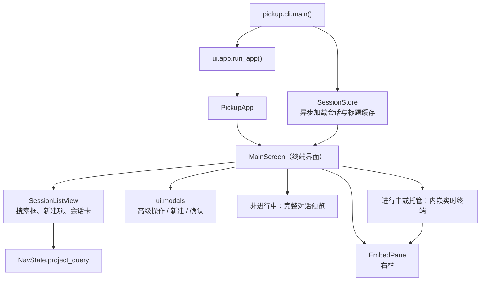
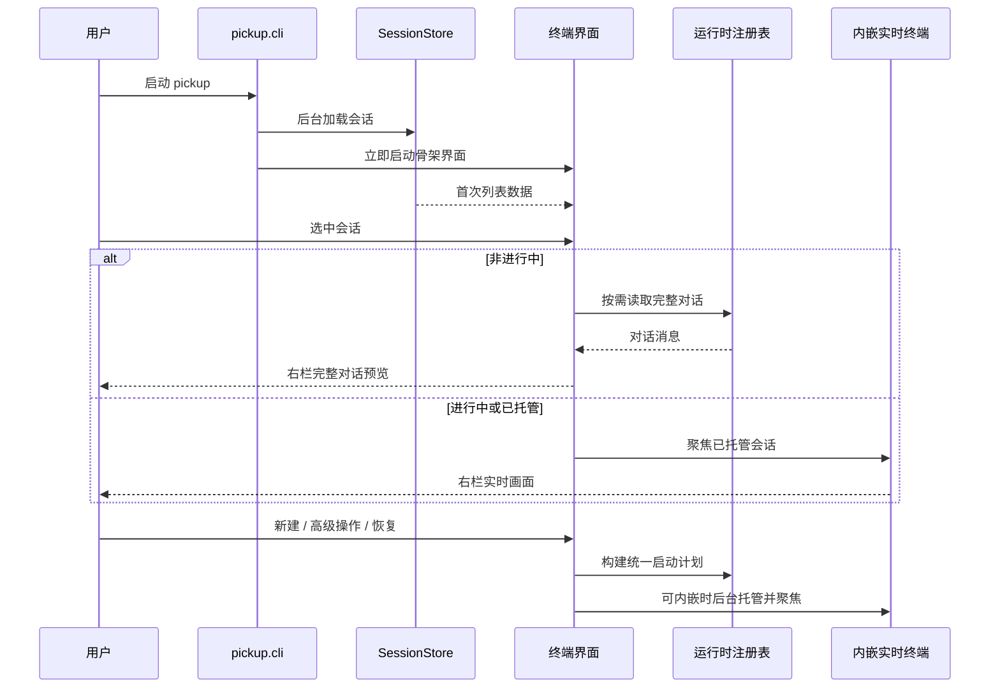
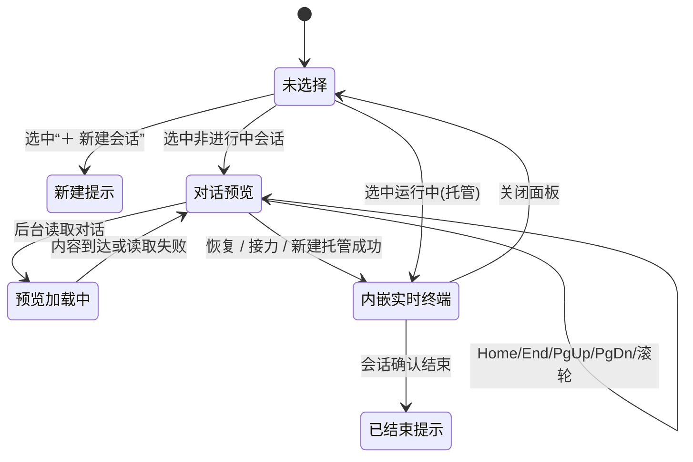

# 终端界面领域知识库

终端界面是 pickup 面向人的唯一交互入口：用户在左栏会话列表与右栏（最多三格均分）中浏览会话、筛选项目、预览已结束会话的完整对话，并可新建、恢复、接力或结束会话。主实现是 Textual 的 `MainScreen` / `PickupApp`；文档正文统一称为“终端界面”。

## §0 目录索引

| § | 标题 | 定位 |
|---|------|------|
| §1 | 业务背景与核心概念 | 首次接触终端界面时读 |
| §1.5 | 架构概览 | 快速建立分层与刷新认知 |
| §2 | 核心业务流程 / 状态机 | 理解启动、选择、预览与操作路径 |
| §2.5 | 物理路径速查 | 直接定位界面代码 |
| §3 | 代码入口索引 | 按改动场景找入口 |
| §4 | 表与字段入口索引 | 查本地状态、缓存与环境口径 |
| §5 | 流程 / 组件 / 任务 / MQ 入口索引 | 改刷新、按键、截图等流程时 |
| §6 | 核心业务规则与隐性约束 | 改代码前必扫的 AI 易错点 |
| §7 | 常见易忽略条件与验证路径 | 完成界面改动后的验证 |
| §8 | 关联文档 | 进入相邻领域时联读 |
| §9 | 覆盖度与待补充项 | 了解证据边界与未确认事项 |

## §1 业务背景与核心概念

pickup 的价值是让用户从一个终端界面中继续或接力不同 Coding Agent 的历史会话，而无需手工记忆历史文件位置、运行时和工作目录。终端界面只负责“看见、选择与发起用户动作”；运行时私有扫描、历史解析、启动参数和实时终端协议均不属于本域。

核心概念：

| 主称谓 | 用户可见含义 | 实现别名 / 边界 |
|---|---|---|
| 终端界面 | 左栏列表 + 右栏（顶栏助手按钮 + 最多三格内嵌） | `PickupApp` 承载应用，`MainScreen` 承载主屏；`SplitPaneArea` 管右栏 |
| 分屏组合记忆 | 活跃会话并排布局的隐式记忆（切走再回来自动恢复同伴） | `split_layout.py` → `~/.cache/pickup/split-layout.json`；仅活跃/托管会话 |
| 侧边栏会话列表 | 左栏的搜索框、新建会话入口及会话卡片 | `SessionListView`、`SessionCard`、`NewSessionCard` |
| 筛选项目 | 顶部输入框按项目名、路径和标题筛选会话 | `NavState.project_query`；不是独立项目列表页 |
| 新建会话 | 以选定项目和运行时创建空白会话 | 侧边栏“＋ 新建会话”完整选择流程，或右栏顶栏点助手加格；无底栏 `n` 快捷键 |
| 高级操作 | 对当前会话选择同运行时恢复或跨运行时接力 | `a` → `choose_target_runtime()` |
| 删除会话 | 彻底抹掉选中会话的本地历史，不可恢复；运行中/托管会话先结束再删 | `x` → `ConfirmModal(confirm_key="x")` → `action_delete_session()` |
| 对话预览 | 右栏展示非进行中会话的完整对话 | 不是旧的“最近提问 / 最近回复”摘要，也不是 Space 全屏页 |
| 进行中 / 已结束 | 左栏用标题颜色区分进程活性 | 进行中（`live` 或 `keepalive_name`）标题绿色；已结束保持默认配色；侧边栏不再展示「运行中 / 已结束」文案；不等于标题模块或机器接口的业务状态标签 |
| 内嵌实时终端 | 右栏展示进行中或已托管会话的实时画面 | 本域只负责挂接 `EmbedPane`；tmux 抓帧与控制通道属于“内嵌实时终端”域 |
| Footer 操作 | 页面底部可发现的快捷操作提示 | Textual `Footer` 从 `MainScreen.BINDINGS` 读取文案 |

终端界面默认英文，中文系统语言自动切换中文；`PICKUP_LANG` 可覆盖语言选择。机器可读的 `pickup list` 等接口不进入本域翻译体系，不能因改界面文案而改变其英文数据契约。

## §1.5 架构概览





## §2 核心业务流程 / 状态机

### 主界面流程

1. `pickup.cli.main()` 确认当前是交互式终端且 tmux 可用，创建 `SessionStore`；会话扫描在后台线程开始，外层终端颜色探测可并行进行。
2. `ui.app.run_app()` 初始化界面语言，创建终端界面。即使扫描尚未完成，界面也先出现骨架：搜索框、＋新建会话和右栏。
3. `MainScreen._on_initial_load_done()` 接到首次扫描完成事件后选择有会话的默认运行时，重建侧边栏，并开启会话刷新与标题缓存轮询。
4. 用户移动或点击侧边栏选择时，`MainScreen._follow_current_selection()` 决定右栏：
   - 有托管名称的会话进入内嵌实时终端；
   - 其他会话先显示详情头，再后台暖加载完整对话，完成后无缝刷新；
   - 选中“＋ 新建会话”时显示新建提示。
5. 用户回车恢复、侧边栏/顶栏新建或 `a` 高级操作。能内嵌时，启动托管工作放到后台 worker，避免 tmux 阻塞冻结界面；无法内嵌时，应用退出并由外层执行启动计划。托管成功后键盘焦点仍留在侧边栏，点右栏才与内嵌会话交互；多分屏下聚焦某一格时，`PaneCell` → `SplitPaneArea._handle_pane_focused` → `MainScreen._on_pane_focused` 会把侧边栏高亮切到对应会话（`SessionListView.select_session_key`），不 remount 右栏。
6. 会话刷新发生变化时，界面原地更新内容；集合或顺序变化时才重建列表。标题缓存变化单独触发轻量刷新。

### 右栏展示状态



“预览加载中”不是用户可见的“连接中”页面：已有历史时立即显示已有详情；刚新建且还没首帧时显示空白终端画布。任何改动都不得重新引入“连接中…”中间文案。

### 新建、恢复与高级操作

| 用户动作 | 前置条件 | 流程 | 结果 |
|---|---|---|---|
| 回车选择会话 | 侧边栏选中已有会话 | 构建恢复或接力计划；优先打开已有托管会话 | 右栏内嵌展示；键盘焦点留在侧边栏 |
| “＋ 新建会话” | 用户需选择项目或运行时 | 先选项目，再选运行时 | 创建空白会话 |
| 右栏顶栏点助手 | 当前项目目录已知且未满三格 | `_on_runtime_pick` 在当前项目下加一格托管 | 新格进入分屏组合 |
| `a` 高级操作 | 当前选中已有会话 | 弹窗列出运行时；同运行时为原生恢复，其他运行时为读取历史后新建会话 | 形成启动请求 |
| `q` 结束会话 | 当前会话是运行中(托管) | 确认弹窗确认后结束托管并立即标记为已结束 | 不等待下次扫描才更新状态 |
| `x` 删除会话 | 侧边栏选中任意会话 | 确认弹窗（确认键为 `x`）确认后，运行中/托管会话先结束再删，随后调用所选运行时适配器的 `delete_session()` 彻底抹掉本地历史 | 成功后立即从列表摘除；失败（如磁盘/数据库异常）则提示失败原因，卡片保留、不摘除 |
| Ctrl/Cmd+点击或 Space | 侧边栏会话卡（非「＋ 新建」） | toggle 多选集（`▸` 标记；最多 3 项）；右栏暂不跟随 | 多选 ≥2 时 Enter 开分屏；Esc 先清多选；↑↓/普通点击清空 |
| 点击右栏 | 右栏已有预览或托管画面 | 键盘焦点转移到右栏 | 此后按键进入内嵌会话；`Ctrl+\` 回列表 |

## §2.5 物理路径速查

| 目录（相对项目根） | 内容 | 关键文件 |
|---|---|---|
| `ui/` | Textual 终端界面组件、状态与弹窗 | `main_screen.py`、`app.py`、`session_list.py`、`nav.py`、`modals.py`、`embed_pane.py`、`split_pane_area.py`、`runtime_top_bar.py` |
| 项目根 | 分屏组合记忆 | `split_layout.py` → `~/.cache/pickup/split-layout.json` |
| `docs/screenshots/` | 虚构演示数据的截图验收脚本与产物位置 | `capture.py` |
| `docs/` | 维护约束、相邻领域知识库与截图说明 | `MAINTAINER_GUIDE.md`、本文件 |
| 项目根 | 启动、会话展示状态、宽度计算与可观测入口 | `pickup.py`、`i18n.py`、`observe.py` |
| 项目根 | Textual Pilot 界面测试与语言测试 | `test_ui.py`、`test_i18n.py` |

## §3 本域代码入口索引

| 场景 | 入口 | 类 / 方法 / 配置 | 说明 |
|---|---|---|---|
| 启动终端界面、非 TTY 降级、直启进入界面 | `src/pickup/cli.py` 等 | `main()`、`_dispatch_direct_launch()` | 交互式入口；扫描、主题探测、标题后台进程和应用启动在此接线 |
| 应用外壳与语言初始化 | `ui/app.py` | `run_app()`、`PickupApp.on_mount()` | 初始化多语言，按外层背景选择浅/深主题，再推入主屏 |
| 主屏布局与 Footer | `ui/main_screen.py` | `MainScreen.compose()`、`_main_bindings()` | 左栏搜索和列表、右栏、Footer 的唯一组合处 |
| 首屏异步加载与后台刷新 | `ui/main_screen.py` | `_await_initial_load()`、`_background_refresh_worker()`、`_poll_cache()` | 等首次扫描、按退避间隔重扫、轮询标题缓存 |
| 选中会话后决定右栏 | `ui/main_screen.py` | `_follow_current_selection()`、`_render_detail()`、`_warm_conversation()` | 非进行中显示完整对话；托管会话挂到右栏实时画面 |
| 侧边栏筛选项目 | `ui/main_screen.py`、`ui/nav.py`、`pickup.py` | `on_input_changed()`、`NavState.project_query`、`_filter_sessions_by_query()` | 查询只有一份状态；按项目名、路径、标题进行大小写无关模糊匹配 |
| 会话卡片、状态和列宽 | `ui/session_list.py` | `SessionCard.render()`、`SessionListView.rebuild()` | 三行：标题 / 运行时靠右 / 时间靠右；进行中绿色标题；按终端显示宽度排版 |
| 新建会话 | `ui/main_screen.py`、`ui/modals.py` | `new_session_flow()`、`pick_project()`、`pick_runtime_for_new_session()`、`_on_runtime_pick()` | 侧边栏「＋ 新建」走项目→运行时；右栏顶栏点助手在当前项目加格。底栏不再绑 `n` |
| 高级操作与结束确认 | `ui/main_screen.py`、`ui/modals.py` | `action_handoff()`、`choose_target_runtime()`、`ConfirmModal` | 高级操作动态读取注册运行时；结束操作先确认 |
| 删除会话（不可恢复） | `ui/main_screen.py`、`ui/modals.py`、`store.py`、`runtime/base.py` | `action_delete_session()`、`ConfirmModal(confirm_key="x")`、`SessionStore.remove_session()`、`BaseRuntime.delete_session()` | `ConfirmModal` 的确认键已参数化（结束会话仍是 `q`，删除会话是 `x`）；实际删除逻辑收敛在各运行时适配器，见 `docs/SESSION_SCANNING_KNOWLEDGE_BASE.md`/`docs/NEW_RUNTIME_ONBOARDING_KNOWLEDGE_BASE.md` 各存储形态的删除方式 |
| 右栏静态预览和实时画面挂接 | `ui/embed_pane.py` | `show_detail()`、`focus_session()`、`scroll_detail()` | 本域仅管理呈现切换、焦点与详情滚动；不描述 tmux 实现 |
| 多语言文案 | `i18n.py` | `_MESSAGES`、`detect_lang()`、`t()` | 新增用户可见文案必须同时给 en / zh；环境优先级在此定义 |
| 宽字符与预览正文格式 | `src/pickup/display.py` 等 | `_text_width()`、`_fit_cell()`、`_preview_lines()` | 中文、emoji 和组合字符按终端显示宽度处理；预览为「角色: 正文」同行，角色与正文同色，可选时间后缀 |
| 本地截图与界面观测 | `observe.py`、`ui/main_screen.py` | `save_tui_screenshot()`、`action_save_screenshot()` | F12 导出当前真实 TUI；对话内容仅由用户主动截图，不能提交 |
| 截图夹具验收 | `docs/screenshots/capture.py` | `_demo_store()`、`_capture()` | 用虚构会话生成左右栏截图，不读真实会话历史 |
| 界面回归验证 | `test_ui.py` | `MainScreenNavigationTests`、`RightPanePreviewTests`、`SidebarVisualLayoutTests` 等 | Textual Pilot 覆盖导航、预览、弹窗、卡片、刷新和内嵌接线 |

## §4 本域表与字段入口索引

本域无持久化业务表；相关本地状态见下。

| 本地文件 / 环境 / 内存状态 | 入口 | 业务语义 | 改动注意 |
|---|---|---|---|
| `~/.cache/pickup/titles.json` | `titles.CACHE_FILE`，由 `SessionStore.poll_cache_updates()` 读取 | 会话标题缓存与标题生成状态 | 写入方必须保持原子替换；界面仅轮询读取，不能在渲染线程生成标题或覆写缓存 |
| 历史文件的 mtime | `SessionStore.conversations`、`get_conversation()` | 对话预览缓存的失效依据 | 路径 mtime 改变才重读；不要把旧详情闭包长期当作最新会话 |
| 进程内会话快照 | `SessionStore.sessions`、`_order`、`hosted`、`_force_ended` | 列表数据、稳定展示顺序、托管兜底和刚结束状态 | 扫描结果替换字典对象；界面必须按稳定会话键重新取最新对象 |
| `PICKUP_LANG` 与 locale | `i18n.detect_lang()` | 终端界面的语言选择 | 优先级为 `PICKUP_LANG`、`LC_ALL`、`LC_MESSAGES`、`LANG`、`LANGUAGE`；机器接口不翻译 |
| `PICKUP_DEBUG` / `PICKUP_LOG` | `observe.init()` | 是否记录额外界面诊断事件 | 日志应脱敏，不能把对话正文或启动参数写入 |
| `~/.cache/pickup/events.log` | `observe.EVENTS_LOG` | 扫描、列表重建、托管、慢抓帧、截图和错误事件 | 仅本地诊断，文件上限 256KB，写失败必须不影响界面 |
| `~/.cache/pickup/embed-error.log` | `observe.EMBED_ERROR_LOG` | 后台刷新或右栏相关异常的 traceback | TUI 占用终端时 stderr 不可见，异常不能只打印 |
| `~/.cache/pickup/screenshots/` | `observe.save_tui_screenshot()` | F12 用户主动导出的真实界面 SVG | 可能含真实对话，禁止提交仓库或自动收集 |

## §5 本域流程 / 组件 / 任务 / MQ 入口索引

本域没有 Flow、MQ 或业务定时任务；以下是终端界面的流程型入口。

| 类型 | 标识 | 代码入口 | 适用场景 |
|---|---|---|---|
| Textual 后台 worker | 首屏加载 | `MainScreen._await_initial_load()` | 先显示界面骨架，等待后台扫描完成，支持退出取消 |
| Textual 后台 worker | 会话刷新 | `MainScreen._background_refresh_worker()` | 每 3 秒起步，连续空闲后最多退避到 10 秒；扫描变化才重建 |
| Textual 定时器 | 标题缓存轮询 | `MainScreen._poll_cache()`，0.5 秒 | 后台标题生成完成后，更新标题与 spinner 而不重扫完整历史 |
| Textual 定时器 | 标题 spinner | `SessionListView._tick_spinner()`，0.15 秒 | 只刷新正在生成标题的卡片；无生成任务直接返回 |
| 按键绑定 | 主操作 | `MainScreen.BINDINGS`、`_main_bindings()` | `a` 高级操作、`q` 结束、`x` 删除、`Esc` 退出、F12 截图；新建不走底栏快捷键 |
| 分屏焦点同步 | 右栏 → 侧边栏 | `PaneCell._notify_pane_focused`、`MainScreen._on_pane_focused`、`SessionListView.select_session_key` | 聚焦某一分屏时侧边栏高亮切到对应会话；不得因此 remount 右栏 |
| 按键路由 | 搜索与焦点 | `MainScreen.on_key()`、`on_input_submitted()` | `/` 聚焦筛选项目；Down/Enter 回列表；Esc 先清空查询再退出 |
| 选择事件 | 会话操作 | `MainScreen.on_list_view_selected()` | 回车针对新建项或当前会话分流 |
| 模态流程 | 高级操作 / 新建 / 确认 | `ui/modals.py` | 运行时选择、项目选择和结束确认；未安装运行时不可确认 |
| 右栏流程 | 静态预览 / 实时画面 | `EmbedPane.show_detail()`、`EmbedPane.focus_session()` | 根据会话是否托管选择展示模式 |
| 截图脚本 | 演示截图 | `docs/screenshots/capture.py` | 生成可提交的虚构数据截图 `docs/screenshots/list.png` |
| 用户触发截图 | 真机截图 | F12 → `MainScreen.action_save_screenshot()` | 排查用户真实界面；产物只能留在本地缓存 |

## §6 核心业务规则与隐性约束

- **AI 易错点**【禁止】恢复旧的全屏预览或纯列表第二套界面。非进行中会话在右栏直接展示完整对话，进行中或已托管会话在右栏挂接内嵌实时终端；Space 全屏预览已经退役。原因：双入口会使按键、滚动、选择和展示语义重新分叉。
- **AI 易错点**【侧边栏末行间隔】搜索框、新建会话项和未来新增的左栏控件，最后一行必须是控件自身高度内的间隔空行；搜索框高 2、新建项高 2。会话卡高 3，三行正文（标题 / 运行时靠右 / 时间靠右），不再另加末行空行；进行中用绿色标题区分，不展示状态文案。禁止用 `margin`、兄弟空隙或 `ListItem` padding 做分隔，因为点击空隙不会命中本项，选中高亮也不完整。
- **AI 易错点**【状态消抖】用户结束托管会话后，必须同时清掉托管标记并立即把 `live` / `pid` 标为结束，且保留强制结束状态直到扫描确认进程真的结束。否则列表会从“运行中(托管)”短暂闪成“运行中”，再延迟变“已结束”。
- **AI 易错点**【新建回调】`NewSessionRequest` 没有关联历史会话；托管成功回调只能对 `LaunchRequest` 读取 `.session`。空白新建路径曾因未区分两种请求而闪退，回归：`test_new_session_request_hosts_without_reading_session`。
- **AI 易错点**【占位卡转正】空白新建或直启后会先用临时会话键显示托管卡，助手写出首条真实历史后再替换为正式会话键。替换时必须按同一托管身份同时迁移分屏记忆、右栏格和侧边栏当前选中键；只迁移右栏会让列表找不到旧键并退回顶部「＋ 新建会话」，随后 `_follow_current_selection()` 会用新建提示覆盖仍在运行的右栏。回归：`test_reconcile_split_keys_after_provisional_becomes_real`。
- **AI 易错点**【分屏焦点与侧边栏】多分屏时用户点到某一格，侧边栏必须切到该格会话高亮（`select_session_key`）；只更新标题栏 `-active` 不够。同步高亮时 `_follow_current_selection` 因 `any_embed_focused()` 早退，避免 remount 抢焦点。
- **AI 易错点**【多语言与绑定】所有新增用户可见文案都进入 `i18n.py` 的 `_MESSAGES`，且同时提供 en / zh。Textual 的按键绑定在类创建时已合并；本地化只能更新 description，不能整体替换绑定表，否则会丢失列表继承的方向键和确认键。
- **AI 易错点**【确认弹窗的确认键已参数化】`ConfirmModal(message, confirm_key="q")` 的确认键不再写死为 `q`：结束会话仍用默认 `q`，删除会话显式传 `confirm_key="x"`。新增任何需要二次确认的危险动作时，必须选一个与触发键一致的 `confirm_key`（而不是复用默认 `q`），否则用户会按错键、或误把另一个动作的确认键当成本动作的确认键。`t("modal.confirm_hint", confirm_key=...)` 的提示行文案同步跟着变。
- **AI 易错点**【宽度不是字符数】侧边栏列宽、标题截断、运行时名右对齐和预览折行一律使用 Rich 的终端显示宽度工具链（`_text_width()` / `_fit_cell()`）；禁止用 `len()`、`ljust()` 或自写 East Asian Width 表。中文、emoji、组合字符会使字符数与终端格宽不一致。
- **AI 易错点**【筛选状态单一来源】筛选项目只认 `NavState.project_query`。搜索框输入、列表渲染、页头数量和新建会话目录推导必须共用它；不要在列表或弹窗另存一份筛选值。
- **AI 易错点**【右栏刷新线程边界】Textual 后台 worker 不得直接读写 Widget/DOM；扫描、读取对话和托管启动等阻塞工作在后台进行，结果通过 `call_from_thread()` 回到主线程。退出时 worker 必须可取消，不能用不可打断的无限等待或长 `sleep`。
- **AI 易错点**【列表刷新策略】会话键的成员与顺序不变时，`SessionListView.rebuild()` 必须原地替换卡片数据，只刷新有变化的卡片；仅新增、删除或重排才清空重建。后台重扫、标题轮询和交互动作可能在同一帧要求重建，主屏必须把完整重建过程串行化；并发执行 `clear()` / `extend()` 会重复挂载固定 ID 的「新建会话」条目并让界面异常。标题 spinner 没有生成任务时直接返回，不能高频复制全部标题状态。回归：`test_screen_serializes_concurrent_list_rebuilds`。
- **AI 易错点**【推导原选中会话必须以 DOM 为准】后台重扫是先 `store.refresh()` 再 `call_from_thread` 触发 `rebuild()`，这一刻 store 已经变了（新会话按 mtime 置顶插入）但 DOM 卡片还是旧的。`rebuild()` 推导「重建前选中的是哪条会话」必须用 `_displayed_selected_key()`（按已渲染的 `_session_cards()` 索引 `self.index`），不能用 `selected_session()`——它是按**刚重算过的** `visible_sessions()` 索引同一个 `self.index`，新会话已经把顺序打乱后，同一下标会指向别的会话。真实复现过：聚焦第三条时后台刷出一条新会话，高亮和右栏跟着串位跳到第二条。`selected_session()` 仍可安全用于用户交互期（回车/删除/结束会话等），那些时刻 DOM 与 store 本就同步。
- **AI 易错点**【详情缓存失效】对话预览按历史文件 mtime 失效；列表扫描后右栏详情也必须失效并按稳定会话键重新读取当前快照。否则标题、状态、摘要或对话会停留在旧字典闭包里。
- **AI 易错点**【右栏滚动语义】静态对话的 `detail_offset`（0 为顶部，增大表示更靠后）与实时画面的 `history_offset`（0 为直播底部）方向相反。滚轮进入静态对话时必须取反，保证“下滚看更晚内容”。选中预览默认钉在最新（`_detail_stick_bottom`）；用户离开底部后刷新不得强行钉回。
- **AI 易错点**【SSH 真彩失真】TUI 颜色变脏/退化到 256 或 16 色，通常是远端缺 `COLORTERM=truecolor`（sshd 未 `AcceptEnv COLORTERM`），不是 pickup 为省带宽降色。见 `docs/MAINTAINER_GUIDE.md` 对应踩坑。
- **AI 易错点**【点击选择】会动态增删的会话卡、新建项和弹窗菜单项必须关闭 Textual 文本拖选；它们的点击语义是选择/确认。右栏内嵌实时终端保留文本选择（划词抬起自动 OSC 52 复制；Ctrl+C 可再复制），不能全局关闭。
- **AI 易错点**【窗口缩放必须防抖 + 冻结重排】拖动期禁止每次 Resize 都 `resize-window`/抓帧；停稳后再改托管窗。改窗后助手常会整屏重排数秒，**禁止把重排中间帧刷到右栏**——已有 live 画面时开启 capture hold，稳定或超时后再一次跳到最新（见 `EmbedPane._begin_resize_capture_hold`）。
- **AI 易错点**【右栏顶栏与分栏标题】助手顶栏按钮靠右排列，背景必须与底部操作栏共用 `$footer-background`，避免出现割裂的纯黑色条。侧边栏与右栏之间、右栏各分栏之间统一保留一列空白间隔：`SplitPaneArea` 左侧 `margin-left: 1`，第二格及后续 `PaneCell` 左侧 `margin-left: 1`；不画任何分隔线或边框，避免终端字体把线条字符渲成连续方块。每格上下各有一条高亮条：标题栏（有标题/关闭）+ 无文字底条（`_PaneFooter`）；默认 `$surface`，聚焦时同步切到主题变量 `$pane-active-background`（`$primary-muted` 再提亮约 10%，便于分辨当前激活格，仍避免高饱和蓝条抢过内嵌内容），标题文字用 `auto 90%` 保证深浅主题下的对比度。禁止再用整圈边框或标题前圆点表示焦点。`PaneCell._sync_active_marker` / `set_title` 必须容忍标题栏/底条尚未挂上或已卸下（双击顶栏快速加格时焦点回调会落在中间态），禁止对 `_PaneHeader` / `_PaneFooter` 裸 `query_one`。
- **AI 易错点**【壳层配色层级】pickup 自有主题是 `pickup-dark` / `pickup-light`（冷静工作台），不是 Textual 默认主题。筛选框用 `$panel` / 聚焦 `$primary-muted`，禁止再铺 `$primary-darken-*` 大色块；列表选中只靠主题 `block-cursor-*` 抬一层冷灰蓝底，**禁止**再给 `ListItem.-highlight` 加 `border-left`——`tall`/`solid` 边框在终端里会和选中底拼成「双蓝条」。分栏激活条用主题变量 `$pane-active-background`（muted 提亮约 10%），不要直接写死 hex 进 widget CSS。饱和色只留给助手标签、运行中状态、警告/错误。
- 【隐性依赖】`Footer` 展示的是 `MainScreen.BINDINGS` 的本地化 description。验证时中文环境必须看到 `a 高级操作`，英文环境必须看到 `a Advanced`；不要再手绘底部帮助行。
- 【隐性依赖】真实终端冒烟必须跑「`pickup` 入口实际加载的包」：`python3 -m pickup`、或对 **pipx / site-packages 同一解释器** 覆盖安装后再敲 `pickup`。系统 `python3 -c "import pickup"` 与 `pickup` CLI 可能不是同一份代码（2026-07-21：源码已钉底、pipx 旧包仍顶对齐）。布局、配色、预览滚动改动后也必须重启已打开的 TUI。命令见 `AGENTS.md`「本机入口」。
- 【隐性依赖】截图验收分两类：`docs/screenshots/capture.py` 使用虚构数据，适合提交和回归；F12 截图反映真实 TUI，可能含私密对话，只能本地诊断。夹具图灰阶的常见根因是环境 `NO_COLOR=1`（Textual Monochrome），不是 cairosvg；`capture.py` 会在创建 App 前清除 `NO_COLOR` 并去掉 Rich 假窗口铬。仍可用真机或 `SessionCard.render_line` segment 交叉确认配色。
- 【消歧】侧边栏用绿色标题表示进行中（含托管），用默认配色表示已结束；这与标题模块的状态标签及机器接口英文 `status` 不是同一套语义，不能互相替换。右栏对话预览头仍可出现 Running/Ended 文案。
- 【消歧】“对话预览”固定在右栏，旧 Space 全屏预览入口不得复活；`e` 全屏接管已删除。默认展示最新消息（底部），不是会话开头。
- **AI 易错点**【禁止】侧边栏选中或回车托管后自动聚焦右栏。焦点必须留在侧边栏，只有鼠标点右栏才进入内嵌交互；右栏滚轮与焦点无关。
- 【边界】本域仅将进行中会话交给 `EmbedPane`。tmux 抓帧、控制通道、鼠标协议、主题注入和输入转发的协议细节转至“内嵌实时终端”领域，不要为改主屏而跨层复制实现。

## §7 常见易忽略条件与验证路径

每次修改终端界面后，先在 `cli/` 项目根执行以下验证；改动范围越接近内嵌右栏、直启或托管，越需要补足真实 tmux 冒烟。

1. 编译与完整单测：

```bash
python3 -m compileall -q src/pickup tests
python3 -m unittest discover -s tests -v
python3 -m unittest discover -s tests -p 'test_ui.py' -v
```

2. 截图验收（界面变更必做）：

```bash
python3 docs/screenshots/capture.py
```

检查 `docs/screenshots/list.png`：左栏搜索框、新建会话、会话卡的末行间隔是否连续可点击；右栏是否为完整对话；Footer 是否存在；中英文、宽字符与截断是否错乱；不得出现“最近提问 / 最近回复”或“连接中”。

3. 真实终端冒烟：为避免标题生成消耗账号额度，在临时目录放置指向本机 `true` 的 `claude`、`codex`，并置于 `PATH` 最前，再运行：

```bash
python3 -m pickup --limit 5
```

人工进入终端界面确认：Footer 显示高级操作；高级操作动态列出运行时且默认选中第一个已安装的其他运行时；Esc 先关闭弹窗再退出；选择已结束会话时右栏展示完整对话（`角色: 消息` 同行且同色）；`/`、Down、Enter 与搜索框 Esc 的焦点行为正确。用户本人还应在真实终端点一次关键路径，这是本域最终的体验验收。

4. 删除会话是不可恢复的破坏性操作，改动 `action_delete_session`/`ConfirmModal`/`SessionStore.remove_session` 或任一运行时的 `delete_session()` 后，必须在临时构造的假会话（而不是真实用户历史）上跑一遍 `x → x 确认` 全流程，确认：卡片立即消失（不必等下次重扫）；对应磁盘文件/目录/数据库行确实被删除；运行中/托管会话先结束再删；删除失败（如模拟磁盘异常）时卡片保留且有失败提示，不能静默摘除列表项。

5. 改动 `SessionListView.rebuild()`/`_displayed_selected_key()` 或任何影响后台重扫与选中态交互顺序的代码后，必须验证「后台刷出新会话时不影响当前选中」：真实构造几条假 Claude 会话，聚焦其中一条非首位的会话，再让扫描发现一条 mtime 更新的新会话触发 `rebuild()`，确认高亮和右栏仍跟着原会话（只是列表位置随之下移），不能串到相邻会话。

6. 改动会话扫描、标题、对话预览或首屏路径时，额外实测扫描耗时并如实记录：

```bash
python3 -c "
import time
from runtime import default_registry
r = default_registry()
t = time.perf_counter()
r.scan_all(50)
print(f'{(time.perf_counter()-t)*1000:.0f}ms')
"
```

首屏目标为 1 秒内，当前是非阻断目标；即使超过也必须报告实测数值并评估是否是本次改动引入。

7. 改动右栏内嵌挂接、托管、新建或直启路径时，运行：

```bash
bash selftest.sh
```

该脚本会使用独立 tmux socket 和隔离环境；不得手动结束或接入机器上已有的真实 `pickup-*` / `sc-*` 会话。除了脚本，还应验证：新建会话不会读取不存在的历史会话；结束托管后列表不闪“运行中”；内嵌失败不会冻结终端界面。

8. 多语言或文本布局改动时：

```bash
python3 -m unittest -v test_i18n test_ui
PICKUP_LANG=zh python3 -m pickup --limit 5
```

确认中文文案完整、CJK 宽度不挤压运行时名；测试断言固定英文时应显式切换语言，不能依赖本机 locale。

## §8 关联文档

- `docs/MAINTAINER_GUIDE.md`：修改、评审或排查终端界面、列表刷新、预览、多语言、可观测、截图、托管或内嵌面板前联读；本文件提炼界面决策，具体历史证据以维护指南为准。
- `AGENTS.md`：终端界面的全局架构边界、侧边栏末行间隔硬约定、验证命令和截图验收要求。
- `docs/EMBEDDED_TERMINAL_KNOWLEDGE_BASE.md`：涉及右栏进行中会话的实时画面、输入、滚动、tmux 连接、抓帧或主题注入时联读；本文件只覆盖其在终端界面的挂接。
- `docs/SESSION_SCANNING_KNOWLEDGE_BASE.md`：涉及会话列表数据来源、判活、对话预览加载或扫描性能时联读。
- `docs/CROSS_RUNTIME_HANDOFF_KNOWLEDGE_BASE.md`：涉及高级操作接力、原生恢复或空白新建的业务分流时联读。
- `docs/OBSERVABILITY_KNOWLEDGE_BASE.md`：涉及事件日志、diagnose、F12 截图或界面异常排查时联读。
- `docs/SKILL.md`：涉及机器可读会话接口时联读；机器接口不是终端界面的替代入口，也不共享多语言文案。
- `PRIVACY.md`：涉及历史读取、对话预览缓存、截图或日志隐私边界时联读。
- `README.md`：修改用户可见的终端界面说明、截图或使用方式时联读；界面语义变化时同步检查说明与图片。

## §9 覆盖度与待补充项

- 代码推断覆盖：已读取主屏、应用外壳、会话列表、导航状态、弹窗、右栏挂接、CLI 启动、国际化、可观测、Pilot 测试与截图脚本；覆盖了启动、加载、筛选、预览、托管入口、状态展示、按键、截图与刷新。
- 领域语言统一：正文以“终端界面”“侧边栏会话列表”“筛选项目”“新建会话”“高级操作”“对话预览”为主称谓；实现别名仅在入口表或首次出现时保留。
- 多源证据补强：`AGENTS.md` 提供架构与验收硬约定；`MAINTAINER_GUIDE.md` 提供已验证的界面历史坑；`test_ui.py` 固化交互和回归行为；截图脚本证明可用虚构数据验收；当前代码确认实际入口。
- 已丢弃误报信号：并发分析中 `agent_api` / 内嵌实时终端的 `_version` 信号不属于终端界面业务状态；本域不将其当作并发版本控制或状态机规则。右栏仅记录其挂接和主线程边界。
- 用户 / 资料补充：用户明确指定个人项目、以 UI 叫法为准、最易出错是 TUI，验收以 Agent 自测加用户本人进入终端点击为准。
- Q&A 补充：本轮无额外问答；已基于用户输入和现有约束沉淀 16 条核心规则与 6 组可执行验证路径。
- 待补充：缺少用户关于“最常用操作组合、最常误触按键、不同终端/字体下的体验差异”的长期经验输入；后续出现真实界面故障时，应由 `doc-update` 将复现条件、用户感知和验证方式补入 §6 / §7。
- 相邻领域：`docs/EMBEDDED_TERMINAL_KNOWLEDGE_BASE.md` 已生成；本文件只保留右栏挂接边界，tmux 协议细节以该知识库为准。
- 待补充：尚未在本轮逐一真机复核 iTerm2、Ghostty、kitty、不同 SSH 链路与中文输入法组合；这类差异优先以真实终端冒烟结论更新，不应从 Textual Pilot 结果推断。
- 待补充：当前没有产品埋点或远程遥测；界面异常只能由本地事件日志、用户主动 F12 截图、Pilot 测试和 `selftest.sh` 交叉定位。
- 文档边界：会话扫描 JSONL/SQLite 格式、标题生成后端、机器接口、保活 socket 的实现细节均已刻意排除，避免本知识库与相邻领域重复且相互矛盾。
- 版本适配：本文件以当前 Textual 主屏实现为准；若界面框架、唯一预览入口或快捷键模型发生架构变更，必须同步重审 §2、§5、§6 与截图验收。
- 运行时验证：本次为文档深写，未运行测试、截图或真实 TUI；§7 给出了当前项目要求的完整验证路径，后续界面代码改动必须实际执行。

<!-- 该文档由 doc-init 生成于 2026-07-19；定位：AI 修改终端界面业务域前的快速参考文档 -->
